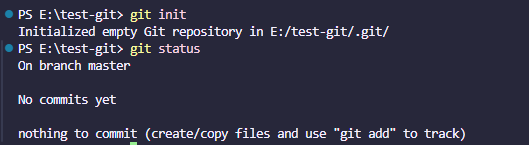
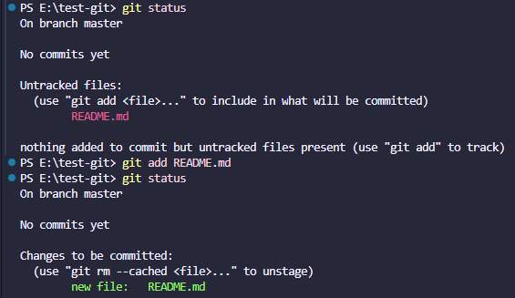
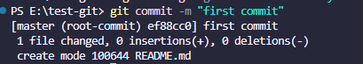
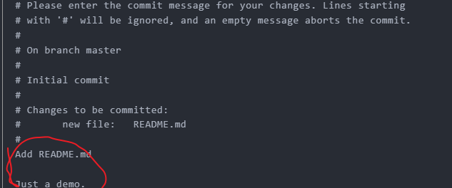
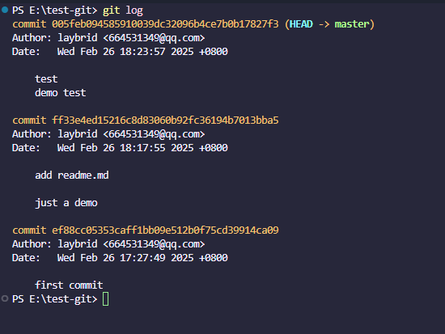
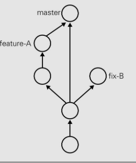
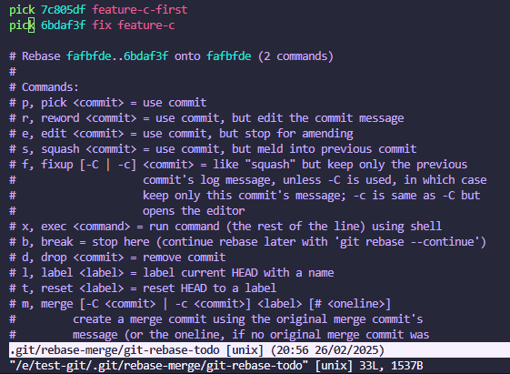
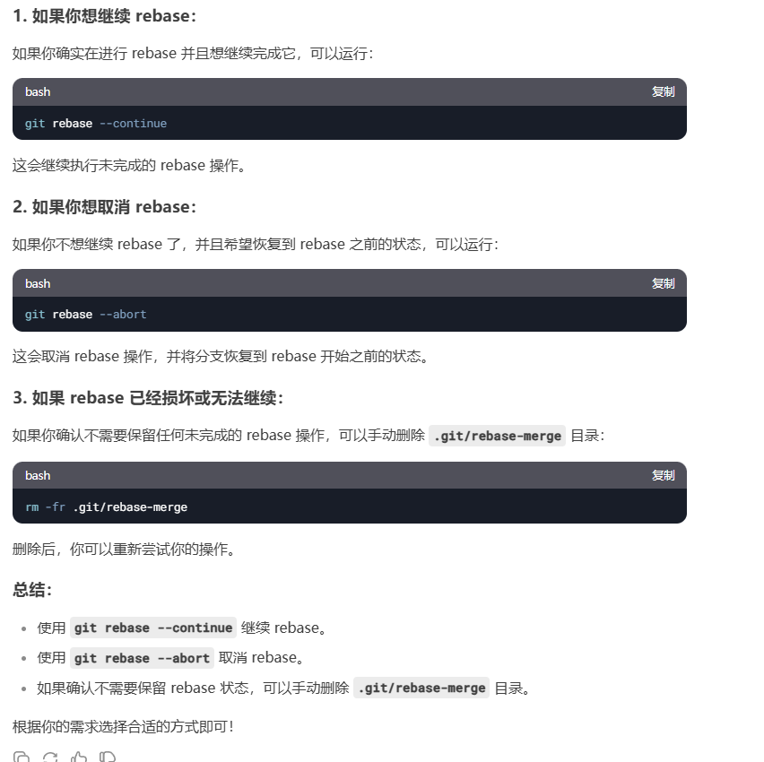
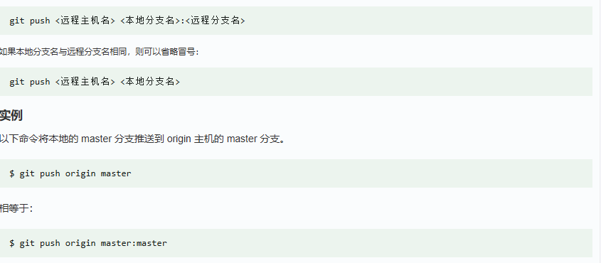
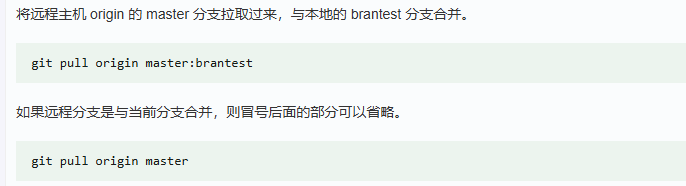

### 1、基本操作

- **git init** 初始化仓库

要使用 Git 进行版本管理，必须先初始化仓库。Git 是使用 git init 命令进行初始化的。请实际建立一个目录并初始化仓库。

如果初始化成功，执行了 git init 命令的目录下就会生成 .git 目录。这个 .git 目录里存储着管理当前目录内容所需的仓库数据。(记录仓库修改的历史)

- **git status** 查看仓库的状态

结果显示了我们当前正处于 master 分支下，接着还显示了没有可提交的内容。所谓提交（Commit），是指“记录工作树中所有文件的当前状态”。

- **git add** 向暂存区中添加文件

  要想让文件成为 Git 仓库的管理对象，（没加入暂存区 那么文件会显示没有被跟踪Untracked files）就需要用 git add 命令将其加入暂存区（Stage 或者 Index 一个概念）中。暂存区是提交之前的一个临时区域。

add前后的一个变化

- **git rm** --cached <文件名> 可以把文件移出暂存区  

  
tips:已经修改的文件可能会让你用 git restore --staged  + git restore  移除 移除完了之后很危险修改的东西全没了 直接初始化

- **git commit**  将暂存区的文件保存到本地仓库的历史记录中，有了历史记录就可以在工作区复原文件

  （如果加了**-m**那就是简洁提交信息  没加 就是记录详细提交信息）

  

   

#号后面都是注释 第一行简介描述 然后空行 然后just a demo为细节描述 然后 :wq（保存退出） :qa强制退出

这个时间关闭编辑器 可以**终止提交**

- **git log** 查看提交日志

分别包含哈希值 作者 提交日期 提交信息 （上到下 最新到最旧）

git log  **--pretty=short**  简洁版日志 （省略日期）

git log  **加文件名** 还可以只显示该文件的提交信息  git log **-p** 可以显示文件变动的具体差异

- **git diff** 查看工作树(当前状态)与暂存区文件的区别  **git diff HEAD**  查看工作树与最新提交的区别

  如果没区别是不会显示信息的 不妨养成这样一个好习惯：在执行 git commit 命令之前先执行 git diff HEAD 命令，查看本次提交与上次提交之间有什么差别，等确认完毕后再进行提交。

git log --graph 图表形式看 当然vscode有 **git graph**的插件 用插件更好

- **git reflog**  git log 命令只能查看以当前状态为终点的历史日志。使用 git reflog 命令，查看当前仓库的**操作日志**

###  2、分支操作

不同分支可以进行完全不同的作业 （多人协作的原理）

- **git branch** 显示分支

- **git checkout -b** 创建并且切换分支

  ~~~
  git checkout -b feature-A 
  
  等同于一下两条命令
   git branch feature-A
   git checkout feature-A
  ~~~

- **git merge** 合并分支  最好是加 **--no-ff 参数** 不然可能git会采取快速合并的策略使得graph不显示分支的创建时间，我们就不清楚什么时候创建的分支

合并前先切换到master分支

### 3、更改提交的操作

通过git灵活操作历史版本进行回溯

- **git reset**   + 哈希值 回溯历史版本 （哈希值只要输入 4 位以上就可以执行）

三种回退模式：

**--soft** 参数在选择的回退点之后的所有更改将会保留并被git追踪下来。

**--mixed 默认** 参数 会保留不会被git追踪

**--hard** 参数撤销工作区中所有未提交的修改内容，将暂存区与工作区都回到上一次版本，并删除之前的所有信息提交

- **git commit --amend** 修改上一条提交信息

- **git rebase -i**  压缩历史 

  有些commit 没必要出现在历史 所以需要压缩历史提交记录合并

  ~~~
   git rebase -i HEAD~2 压缩最新提交在内的两个历史记录
  ~~~

  

  tips:这里有一个细节 就是一般最新的提交需要压缩到上一次提交 所以新的提交反而排列在下面

  删掉前面的pick改为fixup就行 wq安全退出

  有的时候rebase会报错 推荐一些处理方法

  

### 4、推送远程仓库

- **git remote add origin**——添加远程仓库

- **git remote rm origin**-删除远程仓库

- **git push  origin -u**——推送至远程仓库 (origin主机名)

  

第一次push如果加了-u参数 相当于建立连接 后面的push和pull 都可以不需要加任何参数 直接git push

- **git clone**——获取远程仓库

- **git pull origin main**——获取最新的远程仓库master分支 并与当前分支合并

  

如果两人同时修改了同一部分的源代码，push 时就很容易发生冲突。所以多名开发者在同一个分支中进行作业时，为减少冲突情况的发生，建议更频繁地进行 push 和 pull 操作
