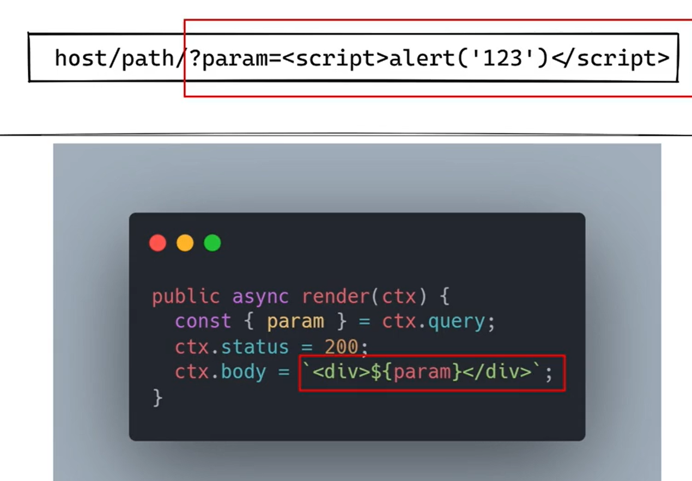
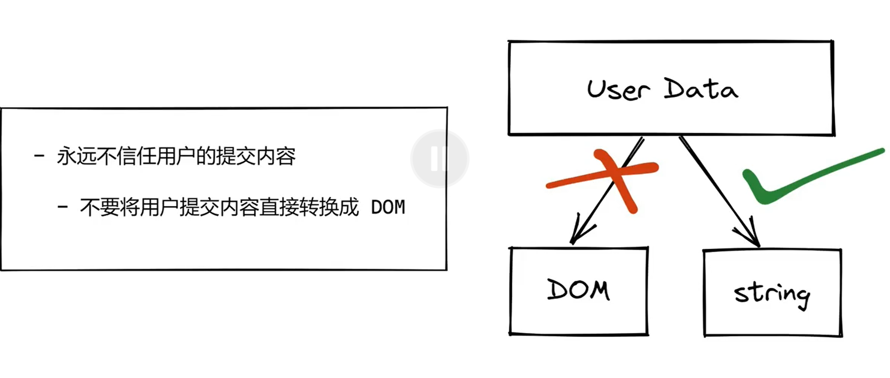

## 1、Cross -Site Scripting (XSS 跨站脚本攻击)

- 解释：其实就是攻击者通过某种方式植入恶意脚本

- 原理：攻击者利用开发者盲目信任用户提交的内容而不做过滤

- 特点

- 漏洞demo

- 用户直接提交了一个script标签 完成攻击

### 1.1、XSS的分类

#### 1.1.1、stored XSS (存储型)

- （比如发的帖子 带了恶意代码但是没有过滤 留在数据库里了 然后又去渲染页面）

#### 1.1.2 Reflected XSS

- 比如你搜一个关键词，然后这个关键词就会在url上 ，假如服务器不过滤url的话就会根据你这个url的关键词返回给你你要的内容，但是如果关键词是代码那就糟了。
- tips:(当然一般人是不会让关键词变成有害的代码的，所以黑客一般在你浏览网站的时候给你钓鱼诱导你点他的链接，达成上述效果)

#### 1.1.3、DOM-based XSS

- 比如对那种哈希值url下手 就不会进服务端了 直接在浏览器端完成攻击

- 区别：**Reflected XSS vs DOM-based XSS** ，前者在服务端完成植入后者跟服务端没关系是在浏览器端完成闭环

#### 1.1.4、Mutaion-based XSS(基于浏览器)

### 1.2、对XSS攻击的防护

- 原理

  

- 工具

  

- 但是如果需要非要让用户生成dom呢？

- 扫描里面的内容 不应该有script标签和奇怪请求

  - 对<>进行转义 “&lt”这种东西
  - 或者直接对标签或者特殊属性屏蔽（设置白名单）
  - **waf防火墙**

- csp

  

  

## 2、Cross-site request forgery(CSRF跨站伪造请求）

- 原理（说白了就是利用**用户登录权限cookie** 把用户骗到自己的网站，然后**伪造一些转账请求**等，这个时候由于**服务端分不清是黑客操作还是用户自己操作**，从而完成攻击）

### 2.1、CSRF的分类

#### 2.1.1、CSRF-get

​	

#### 2.1.2、SQL Injection

#### 2.1.3、服务端的注入（带一些恶意执行的参数 来攻击）

- 下面就是请求参数带了cli命令行的命令

### 2.2、对CSRF攻击的防护

- 1、对请求源进行鉴定（一些奇怪的源过来的请求不要鸟）

- 2、如果黑客伪造请求源那第一步就没b用了
- 3、所以需要从cookie用户登陆权限这边做限制，不要让黑客拿到用户权限

- 4、如果还是不幸拿到权限了或者cookie不方便设置的那么死，就要采取**Token鉴权**（与服务端对暗号进行校验）的方式或者**发送手机短信**的方式确保是用户操作

  - ​	**Token(鉴权)**

    - 存储在服务端 因为cookie都被偷了（假设） 不要放在cookie里了
    - 客户端每次请求传递Token 服务端进行校验

  - 工程使用一般放在meta标签（方便通过js调用）

    

    每次刷新网页这个内容都会刷新。每次用完会销毁

## 3、DOS

- 原理：制造一些特定请求来不断消耗服务端资源导致请求挤压，服务器雪崩

### 3.1、DOS的分类

#### 3.1.1、基于正则表达式dos

- 原理：基于正则表达式的贪婪匹配规则（？）发送一个让服务端恶心的请求从而不断消耗资源

#### 3.1.2、DDOS

第三次握手攻击者不发送 所以链接始终不断开

### 3.2、对DOS攻击的解决

- 防止DOS 要么升级软件硬件  要么砸钱cdn 负载均衡（搞多个服务器）

## 4.中间人攻击

- ARP欺骗 （本来数据会发送到网关 但是黑客通过ARP欺骗，发送冒充网关的ARP报文  让数据流到了黑客那边 然后黑客再发送消息给网关冒充客户，两头骗）
- 代理服务器（利用贪便宜的人性，免费给别人代理，诱导别人用代理服务器，然后获取 信息）
- dns欺骗（域名解析本来解析到目标机器的ip 但是黑客这么搞了之后解析的结果是黑客控制的服务器的ip ）

窃取信息返回结果

### 4.1 防御中间人攻击

