## 1、cookie的用法与常用属性

### 1.1、cookie的解释

~~~
	浏览器暂时会存储一些东西在cookie里
	这些数据在你的电脑硬盘上，cookie的作用域是以站点为区分的
    不同浏览器之间cookie不共用
tips:跨站是什么意思：顶级域名和二级域名一样就是同站，否者就是跨站
a.com  b.com 跨站    subs.a.com  a.com 同站  （com为顶级域名 a为二级域名）
~~~

### 1.2、cookie的基本语法

~~~
1、 拿到浏览器cookie
document.cookie    // 拿到浏览器所有的cookie 除了有httpOnly属性的cookie
2、添加cookie 变更cookie
document.cookie = 'key=value;'//浏览器有这个同名的键值对就变更属性否则就是添加 一个document.cookie只能创建一条cookie
3、删除一条cookie
document.cookie = 'key=value; max-age=-1' //直接删除这一条cookie
4、如何方便获取浏览器所有的cookie
let obj = document.cookie.split(';').reduce((pre, cur) => {
	const [key,value] = cur.split('=')
	pre[key] = value
	return pre
},{})
~~~

### 1.3、cookie的各项属性

#### 1.3.1、domain

- domain属性决定cookie能够作用的主机地址

- domain属性跟端口和协议无关 也就是说两个url端口协议不同 cookie也是会存在的

  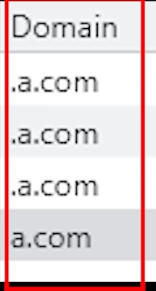

- 前面的 “.” 说明这个cookie可以用作与当前的域和子域 比如a.com向上面这么设置 那么subs.a.com可以访问到前三条带.的cookie  
- domain设置上是有坑的 比如不写domain属性那么cookie就不带点 写了domain= 'a.com' 那就是.a.com!  .a.com是一样的
- 子域可以给父域种cookie 但是父域不可以给子域和跨域种cookie

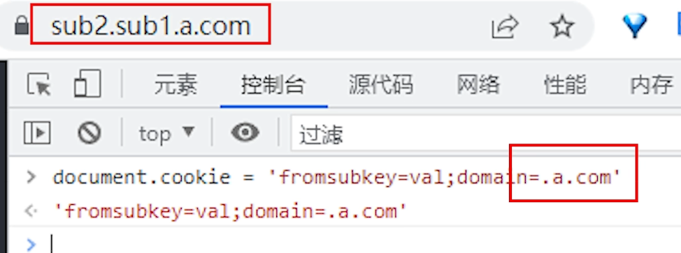

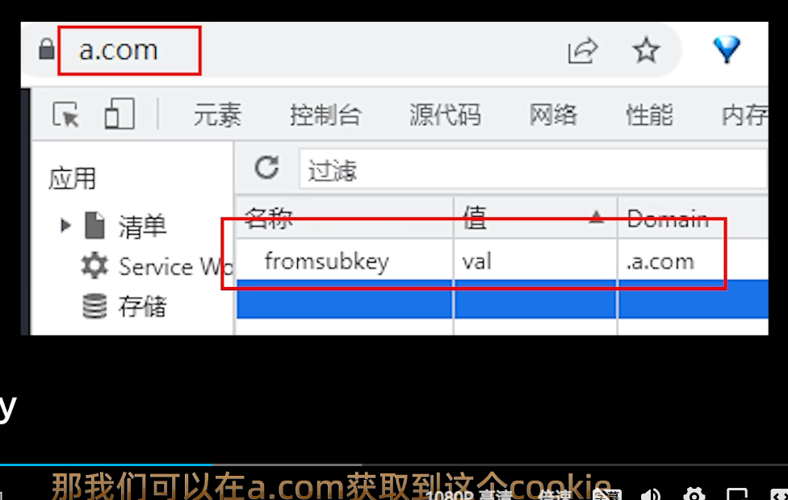

反过来这样设置domain就不行

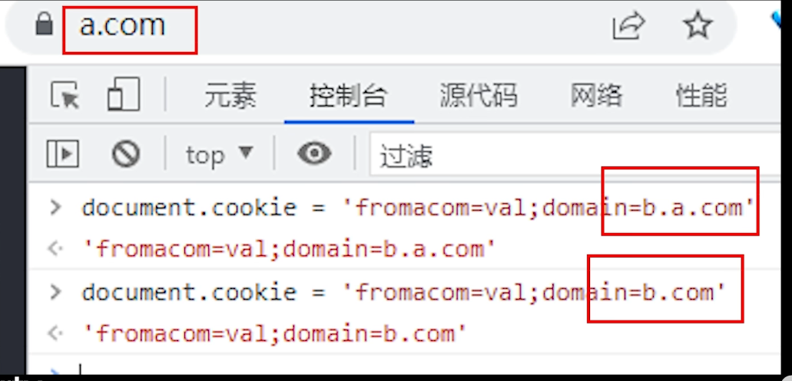

#### 1.3.2、 path

- 设置了path属性url后面接的路径就可以根据path访问这个cookie了

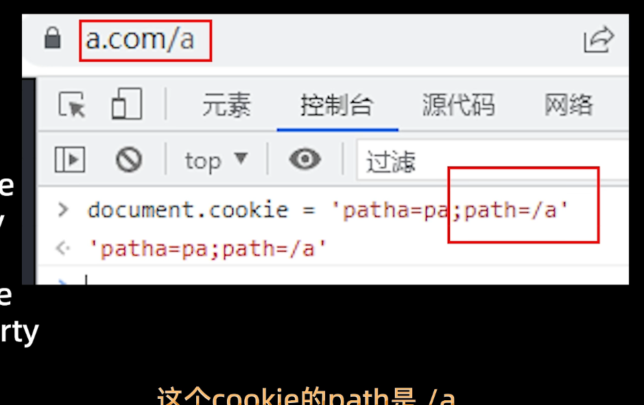

这样就有

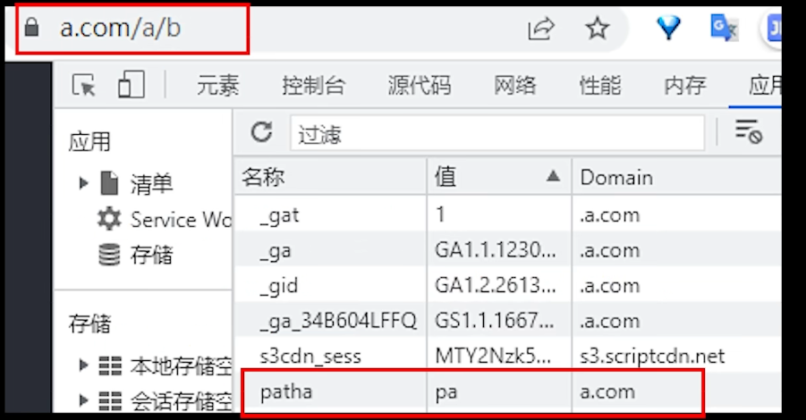

这样就没有

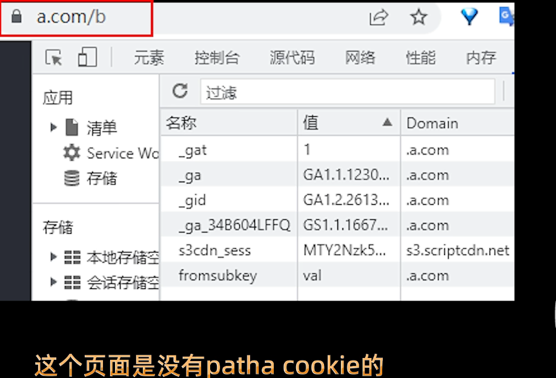

#### 1.3.3、expires和max-age

- 这两个属性都是设置cookie的有效期（同时存在 max-age优先级更高）

  

- max-age设置负值会删除cookie，expires设置为过去时间也会删除
- 没有设置这个两个属性就是**会话cookie** 关闭浏览器会删除

#### 1.3.4、httpOnly

- 只有服务端才能设置 带这个属性的cookie，js设置会被浏览器忽略

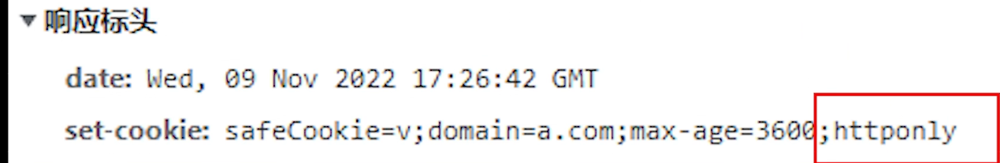

- 作用：有这个属性就只能被浏览器和服务端操控 通常用作用户的身份信息 防止恶意插入js代码盗取用户信息

#### 1.3.5、secure

- 这个cookie只能用https传输 并且设置带secure属性的cookie也只能在https页面设置

#### 1.3.6 、samesite

- 一般做跨站请求的时候 设置这个属性对请求是否携带cookie进行一种约束

- None Strict Lax（不写这个属性和Lax行为是一样的） None必须是https协议下才有效 而且必须添加secure属性

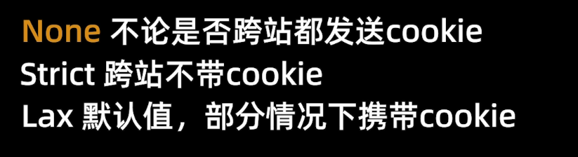

- Lax属性的基本行为（针对跨站）

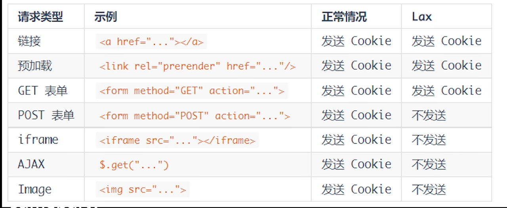

- 当然很多时候得先解决跨域的问题 才会再去解决跨站的问题 从而这些属性才用得上

## 2、浏览器存储-关于cookie localstoreage sessionstorage的比较

- 共同点：
  - 保存在浏览器且同源

- 区别：
  - cookie始终在与同源的http请求中携带，即浏览器和服务器之间传递数据会携带cookie，但是后面两个只是本地存储不会跟请求过去 （tips:同源必定同站了 浏览器对同源的要求比对同站的要求高多了！！！）
  - 由于同源请求会携带cookie 所以cookie只能存最多4k的数据，后面两比cookie大多了
  - 数据有效期不同
  - 作用域 sessionStorage 只作用于当前页面，localstorage在所有同源窗口中都是共享的；cookie也是在所有同源窗口中都是共享的(看设置 一般是当前域和子域)
  - web Storage支持事件通知机制，可以将数据更新的通知发送给监听者
  - web Storage的api接口使用更方便

## 3、Cookie、Session、Token 实现用户登录

### 3.1 、cookie实现用户登录

- 原理图

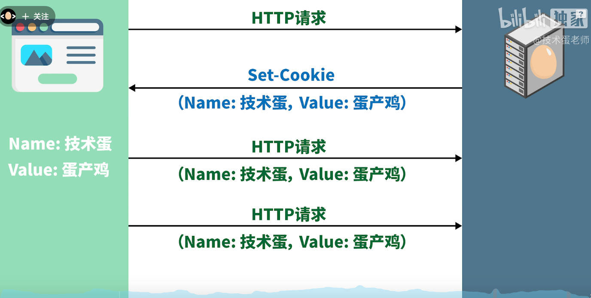

其实就是服务端给浏览器种一个带用户名和密码的cookie，很不安全，因为cookie的信息容易被盗取

### 3.2、基于cookie利用session进行用户登录的实现

- 原理图

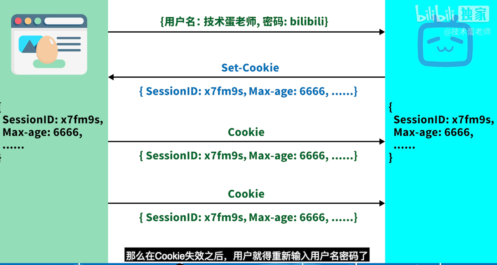 

其实就是服务端给浏览器种一个携带了sessionID的cookie 根据这个sessionID（随机生成的字符串） 来分辨不同用户的登录

- 相关代码如下

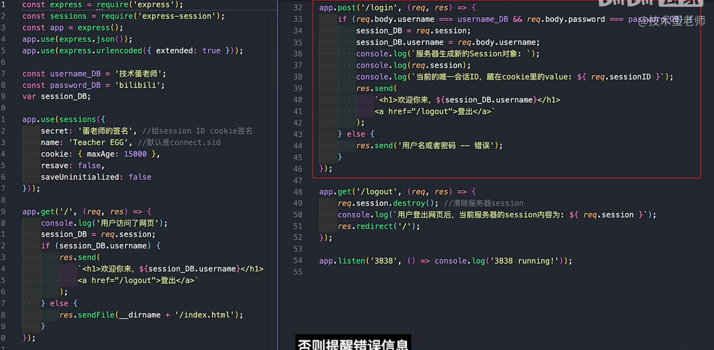

~~~
其实就是通过 sessions 中间件创造出session对象 并且收到浏览器请求后会自动去种cookie 并且让req.session req.sessionID可以访问到session对象和sessionID。
弊端：如果用户很多的话 sessionID就会需要很大的空间进行额外存储 本身sessionID也比较长了
~~~

### 3.2、基于cookie利用Token实现用户登录

- 原理图

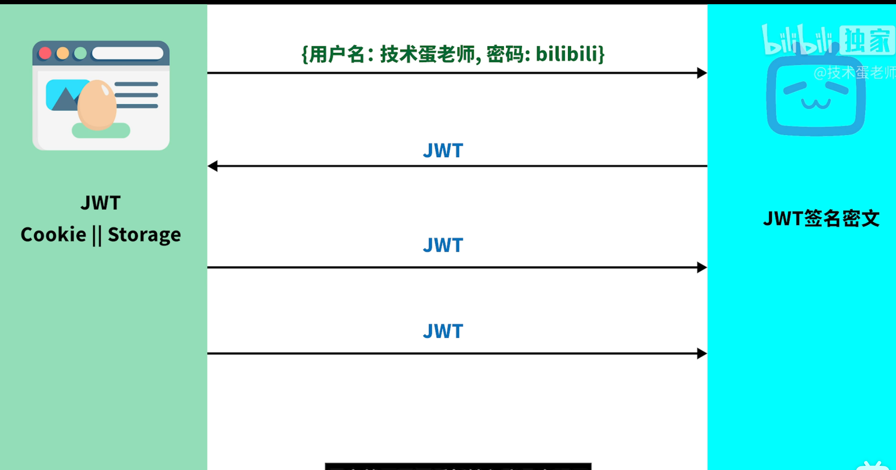

其实就是利用jwt去取代sessionID

- jwt的组成与计算方式

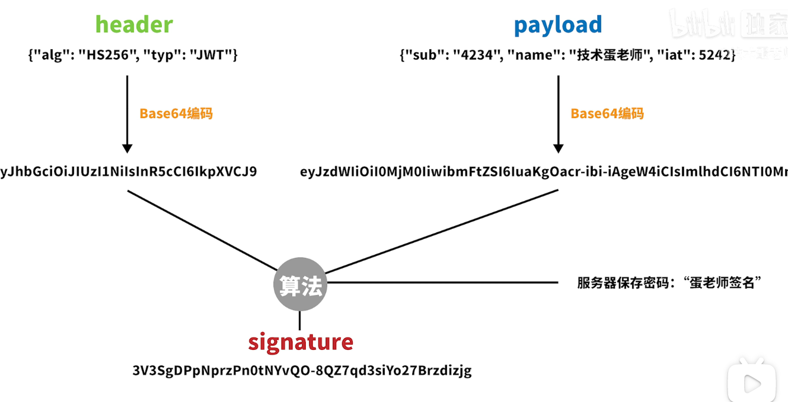

- 相关代码如下

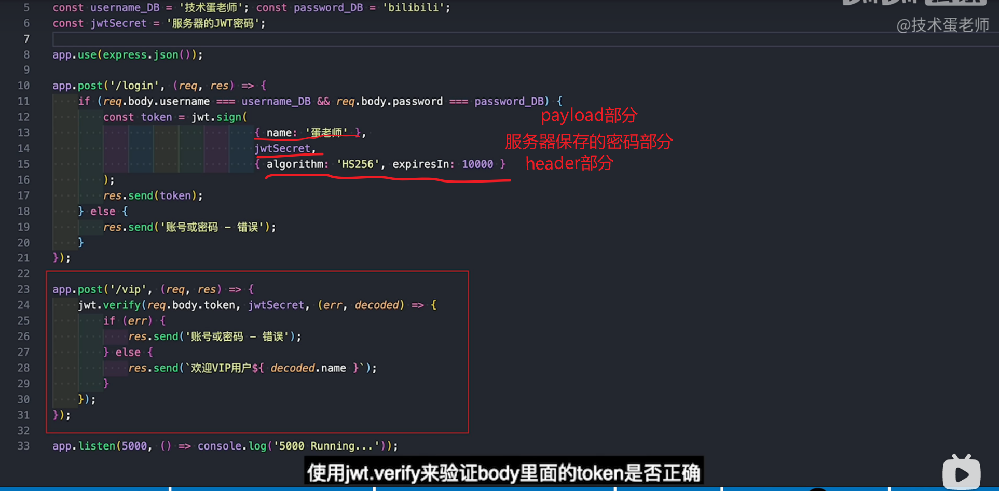

~~~
其实就是jwt代替sessionID 但比较牛逼的是 jwt里面存了用户相关的信息在payload部分 所以jwt本身就是一个能区别用户身份的变量，所以服务器或者服务器集群或者数据库只用存一个相同的服务器密码用来生成jwt就行了，不用像session一样要在服务器存那么多sessionID区分用户
~~~

## 4、总结Cookie Session Token

- session 诞生于服务器 保存在服务器 以cookie为载体 sessionID 为识别 进行用户自动登录

- Token 诞生与服务器 保存在浏览器  以cookie为载体 jwt为识别
