## 1、http协议初识

- 什么是http协议？？

  基于TCP协议的应用层的超文本传输协议

  用处：定义了浏览器（万维网服务器的客户进程）怎么向万维网服务器请问文档，以及服务器怎么把文档传送给浏览器

- 特点：

  - 每次请求都伴随响应
  - 可拓展（可以在请求头写一些东西）
  - 无状态（每个请求独立，当前的请求不知道上次的请求携带了什么信息 但是后面新增了cookie）

### 1.1、http发展过程

- **http/0.9** （单行协议）
  
  - 只支持html的传输
  
- **http/1.0**（构建可拓展协议）

  - 多种Hedaer

  - 有了状态码 
  - 新增多种文档类型（css js等）

- **http/1,1**（标准化协议）
  
  - 多复用 （多个http 共用一个tcp连接）
  - 内容协商（请求部分资源 range头）
  - 缓存（etag if -none -match字段）
  - 新增请求方法（PUT、HEAD、OPTIONS）
  
- **http/2.0** 
  
  - 二进制协议 （头信息和数据体都是二进制，称之为帧，每个帧有一个流标识符，服务端根据流标识符可以判断哪个包对应哪个请求，为多路复用提供基础，所以不用按顺序发送请求，解决1.1的队头堵塞的问题）
  - 压缩Header（有些重复字段重复发送影响速度浪费带宽 首部表记录重复的字段）
  - 服务器推送 (serve push 有很多问题目前 可能安全问题也有)
  - 缺点：没有解决tcp层面的队头堵塞问题，并且serve push问题很多 ，也有一定安全问题（DDOS非对称攻击）
  
- **http/3.0**

  HTTP/3基于UDP协议将TCP和TLS的握手过程整合到了一起，实现了类似于TCP的多路复用数据流、传输可靠性等功能，这套功能被称为QUIC协议。

  - UDP上增加了拥塞控制 数据包重传 让它变可靠
  - 集成TLS加密功能
  - 多路复用

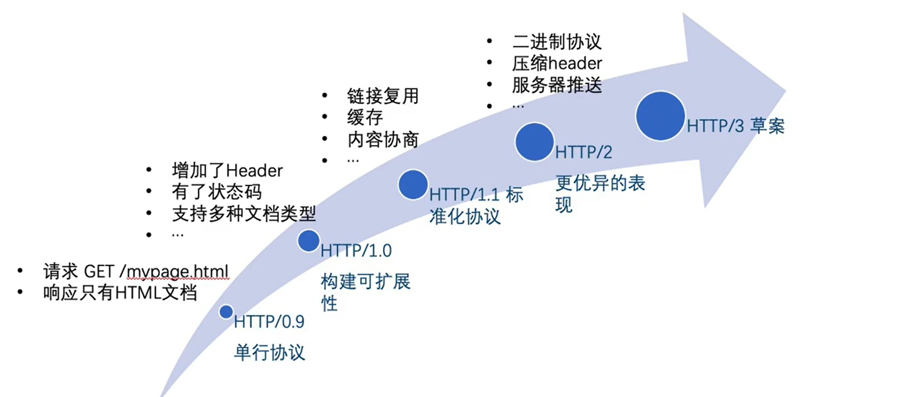

### 1.2、分析报文

#### 1.2.1、method请求方法

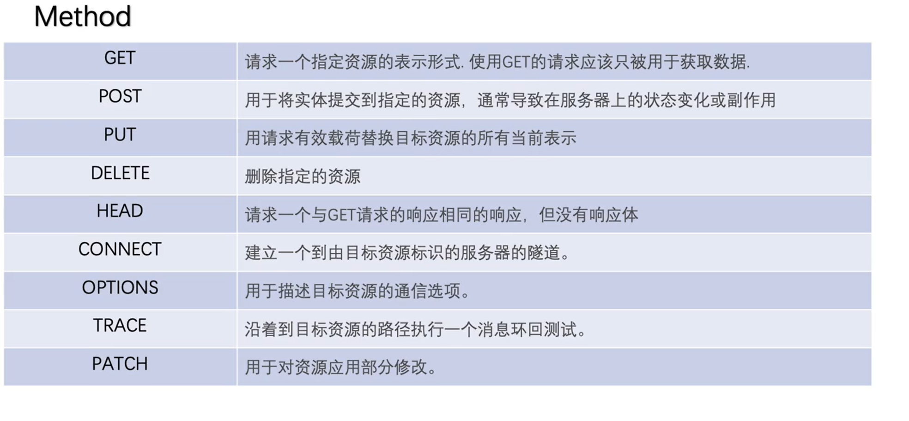

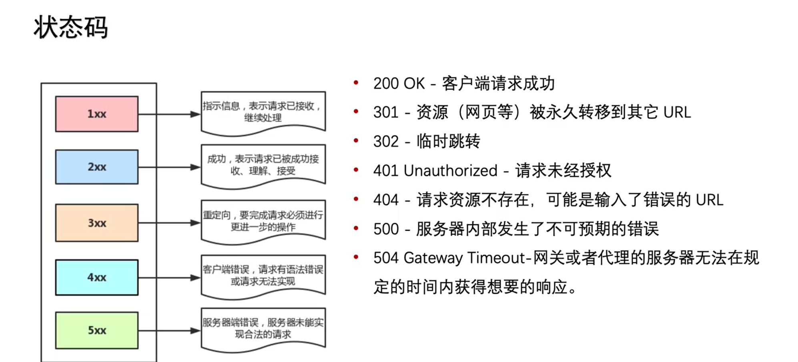

#### 1.2.2、常用请求头

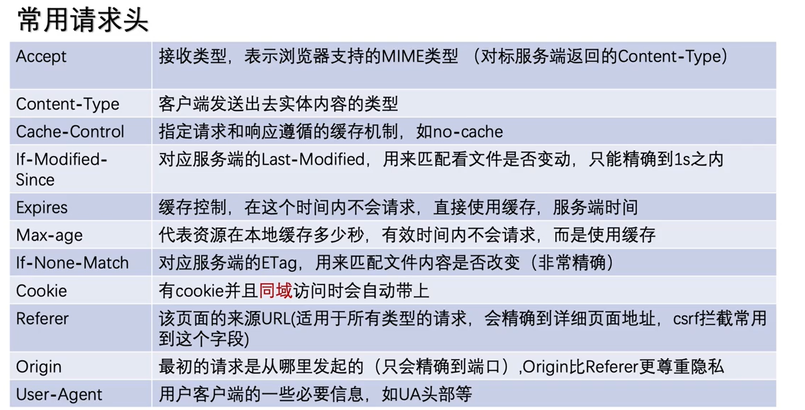

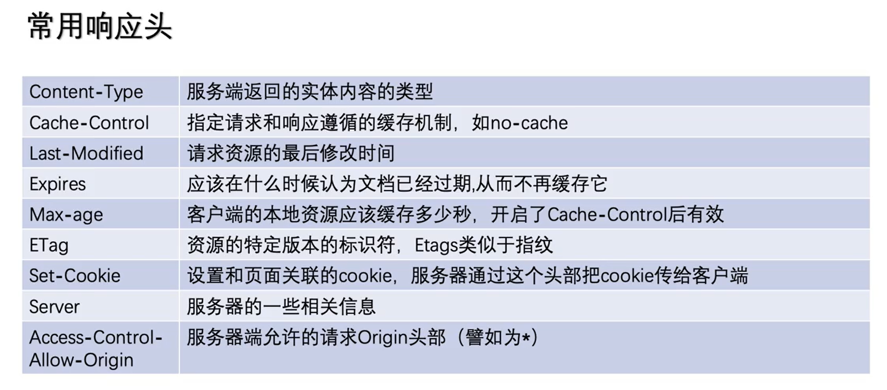

### 1.3、 当在浏览器中输入 Google.com 并且按下回车之后发生了什么？

~~~
（1）解析URL： 首先会对 URL 进行解析，分析所需要使用的传输协议和请求的资源的路径。如果输入的 URL 中的协议或者主机名不合法，将会把地址栏中输入的内容传递给搜索引擎。如果没有问题，浏览器会检查 URL 中是否出现了非法字符，如果存在非法字符，则对非法字符进行转义后再进行下一过程。
（2）缓存判断
（3）DNS解析： 下一步首先需要获取的是输入的 URL 中的域名的 IP 地址，首先会判断本地是否有该域名的 IP 地址的缓存，如果有则使用，如果没有则向本地 DNS 服务器发起请求。本地 DNS 服务器也会先检查是否存在缓存，如果没有就会先向根域名服务器发起请求，获得负责的顶级域名服务器的地址后，再向顶级域名服务器请求，然后获得负责的权威域名服务器的地址后，再向权威域名服务器发起请求，最终获得域名的 IP 地址后，本地 DNS 服务器再将这个 IP 地址返回给请求的用户。用户向本地 DNS 服务器发起请求属于递归请求，本地 DNS 服务器向各级域名服务器发起请求属于迭代请求。
（4）获取MAC地址： 当浏览器得到 IP 地址后，数据传输还需要知道目的主机 MAC 地址，因为应用层下发数据给传输层，TCP 协议会指定源端口号和目的端口号，然后下发给网络层。网络层会将本机地址作为源地址，获取的 IP 地址作为目的地址。然后将下发给数据链路层，数据链路层的发送需要加入通信双方的 MAC 地址，本机的 MAC 地址作为源 MAC 地址，目的 MAC 地址需要分情况处理。通过将 IP 地址与本机的子网掩码相与，可以判断是否与请求主机在同一个子网里，如果在同一个子网里，可以使用 ARP 协议获取到目的主机的 MAC 地址，如果不在一个子网里，那么请求应该转发给网关，由它代为转发，此时同样可以通过 ARP 协议来获取网关的 MAC 地址，此时目的主机的 MAC 地址应该为网关的地址。
（5）TCP三次握手
（6）HTTPS握手： 如果使用的是 HTTPS 协议，在通信前还存在 TLS 的一个四次握手的过程。首先由客户端向服务器端发送使用的协议的版本号、一个随机数和可以使用的加密方法。服务器端收到后，确认加密的方法，也向客户端发送一个随机数和自己的数字证书。客户端收到后，首先检查数字证书是否有效，如果有效，则再生成一个随机数，并使用证书中的公钥对随机数加密，然后发送给服务器端，并且还会提供一个前面所有内容的 hash 值供服务器端检验。服务器端接收后，使用自己的私钥对数据解密，同时向客户端发送一个前面所有内容的 hash 值供客户端检验。这个时候双方都有了三个随机数，按照之前所约定的加密方法，使用这三个随机数生成一把秘钥，以后双方通信前，就使用这个秘钥对数据进行加密后再传输。
（7）返回数据
（8）页面渲染
（9）TCP四次挥手
~~~

### 1.4、http状态码

- **1xxx(Informational(信息性状态码))**
  - 100 （继续，表示已经接收到一部分数据了，等待另一部分数据接受）
  - 101  （切换协议） 请求者已要求服务器切换协议，服务器已确认并准备切换。

- **2xxx(success  成功状态码)**
  - 200 ok（表示客户端发来的请求被服务器端正常处理了）
  - 204 No Content （没有返回实体内容）
  - 206 Partial Content（范围请求 http1.1 range头部 返回数据的一部分）
- **3xxx(重定向状态码)**
  - 301 永久重定向 （该状态码表示请求的资源已经被分配了新的 URI，以后应使用资源指定的 URI，浏览器是默认给一个很长的缓存，搜索引擎会抓取网址B的内容，同时将网址保存为B网址。）
  - 302 临时重定向（只是临时性质的。也就是说已移动的资源对应的 URI 将来还有可能发生改变，浏览器302是不缓存的。，搜索引擎会抓取网址B的内容，同时将网址保存为A网址。）
  - ps: 302劫持 就是一个黑客写了一个垃圾网站 302重定向到你的好网站 出于某种原因（比如他的网址比你好看）， Google 搜索结果所显示的仍然是网址A 他就吃了流量了
  - 303 seeother (该状态码表示由于请求对应的资源存在着另一个 URI，应使用 GET 方法定向获取请求的资源)
  - 304 Not Modified (跟浏览器缓存相关 和重定向没关系)
- **4xxx(客户端错误状态码)**
  - 400 请求报文语法错误
  - 401 该状态码表示发送的请求需要有通过 HTTP 认证
  - 403 权限认证
  - 404 没有找到请求资源
  - 405 服务器禁止使用请求方法
- **5xxx（服务端错误状态码）**
  - 500  服务端执行错误
  - 502  代理服务器出错
  - 503 服务器维护

## 2、http2

- 更快更稳定更简单

  - 每一个msg换成帧（二进制码）传输 （还有压缩算法 压缩header）速度更快

  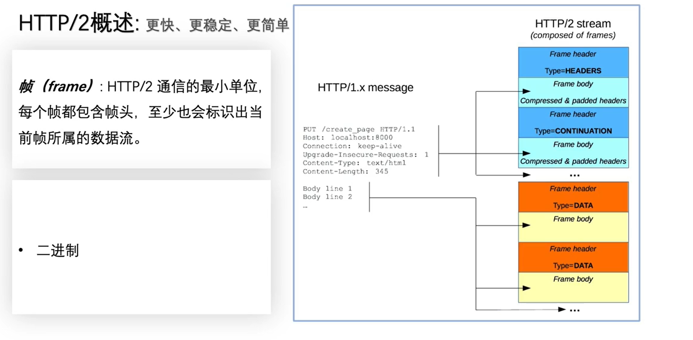

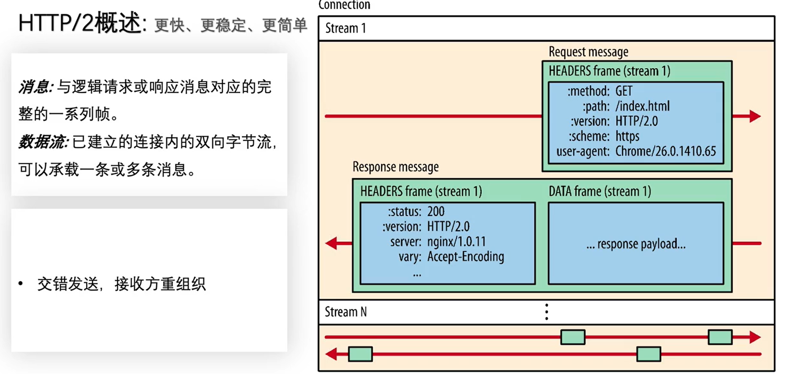

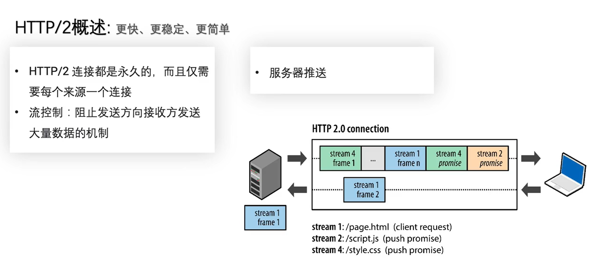

## 3、https

超文本传输安全协议（Hypertext Transfer Protocol Secure，简称：HTTPS）是一种通过计算机网络进行安全通信的传输协议。HTTPS经由HTTP进行通信，利用**SSL/TLS**来加密数据包。HTTPS的主要目的是提供对网站服务器的身份认证，保护交换数据的隐私与完整性。

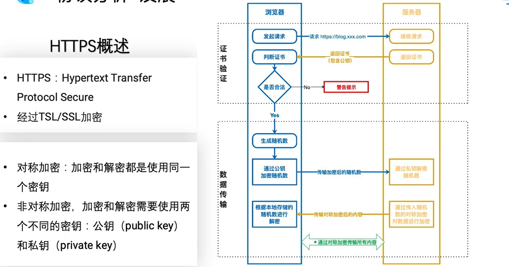

### 3.1、TLS SSL/数字证书工作原理

**TLS/SSL**全称**安全传输层协议**（Transport Layer Security）, 是介于TCP和HTTP之间的一层安全协议，不影响原有的TCP协议和HTTP协议，所以使用HTTPS基本上不需要对HTTP页面进行太多的改造。

依赖三类算法： **散列函数hash**、**对称加密**、**非对称加密**

- 作用如下：

  - 基于散列函数验证信息的完整性
  - 对称加密算法采用协商过后的秘钥对数据加密
  - 非对称加密实现身份认证和秘钥协商

- #### 散列函数hash

  - 只要数据更改就会更改函数的结果，所以散列函数可以保证数据的完整性

- #### 非对称加密

  TLS的1.2版本基于两个最核心的算法**RSA  DH** (都是经典的非对称加密算法)

  - RSA
    -  首先服务端有 一把公钥和私钥 公钥加密 私钥解密  这个公钥是服务端随便往外发的 客户都有
    - 客户端拿到发的公钥之后 就把自己选择的私钥 放进去加密 然后 发给服务端
    - 服务端拿到之后，私钥解密，就拿到了接下来通信的私钥，确定了双方的加密通信方式
    - 特点：服务器只需要维持一个私钥就可以和多个客户端进行通信，（但是客户端和客户端之间不能相互解密，因为只有公钥)
  - DH
    - 首先交流双方都有一把私钥 并且交换协商参数
    - 双方用自己的私钥 和对方的协商参数 可以算出一个同一个秘钥 然后用这跟密钥确定双方的通信方式
  - ps:协商参数是什么东西：根据一个协商公式 双方都生成一个随机数 套公式 得到协商参数，协商参数和协商公式是无所谓被黑客拿到的 ，因为公式里的其他常数老大了 逆向运算很困难

- **对称加密**

  - 对称加密的方法是，双方使用同一个秘钥对数据进行加密和解密，那么秘钥怎么保证是安全的呢，就参考上面的非对称加密
  - 特点： 对称加密的优势就是信息传输使用一对一，需要共享相同的密码，密码的安全是保证信息安全的基础，服务器和N个客户端通信，需要维持N个密码记录且不能修改密码

  **数字证书：**

  - 由来：

    现在的方法也不一定是安全的，因为没有办法确定得到的公钥就一定是安全的公钥。可能存在一个中间人，截取了对方发给我们的公钥，然后将他自己的公钥发送给我们，当我们使用他的公钥加密后发送的信息，就可以被他用自己的私钥解密。然后他伪装成我们以同样的方法向对方发送信息，这样我们的信息就被窃取了，然而自己还不知道。为了解决这样的问题，可以使用数字证书。（说白了公钥可能是假的公钥）

  - 解决：

    首先使用一种 Hash 算法来对服务端公钥和其他信息进行加密，生成一个信息摘要，然后让有公信力的认证中心（简称 CA ）用它的私钥对消息摘要加密，形成签名。最后将原始的信息和签名合在一起，称为数字证书。当接收方收到数字证书的时候，先根据原始信息使用同样的 Hash 算法生成一个摘要，然后使用公证处的公钥来对数字证书中的摘要进行解密，最后将解密的摘要和生成的摘要进行对比，就能发现得到的信息是否被更改了。（说白了就是利用公证处的私钥 公钥 进行解密比对公证处的hash算法生成摘要，从而判断信息有没有被篡改）
    
    ps:假如黑客把签名 证书全拿走了也没事，因为里面的内容本来基本就是公开的，而且你解密了签名之后（利用CA的公钥），没有CA的私钥去加密，那也是暴露了你中间人的身份了。如果你随便加密的话，客户用CA的公钥解密就是一堆乱码。（说白了就是内容不重要，而且解开很轻松但是和原来一样加密做不到因为没有CA的私钥）

### 3.2、https的握手

HTTPS的通信过程如下（假设用RSA算法）：

1. 客户端向服务器发起请求，请求中包含使用的协议版本号、生成的随机数以及客户端支持的加密方法发给服务端。
2. 服务器端接收到请求后，确认双方使用的加密方法（假设是RSA算法）。然后服务端将生成的随机数和自己的公钥用CA的私钥加密，形成数字签名和证书一起发送出去。
3. 客户端确认服务器证书有效后，生成一个新的随机数，并使用数字证书中的公钥，加密这个随机数，然后发给服务器。并且还会提供一个前面所有内容的 hash 的值，用来供服务器检验。
4. 服务器使用自己的私钥，来解密客户端发送过来的随机数。并提供前面所有内容的 hash 值来供客户端检验。
5. 客户端和服务器端根据约定的加密方法使用前面的三个随机数，生成对话秘钥，以后的对话过程都使用这个秘钥来加密信息。

HTTPS的通信过程如下（假设采用DH算法）：

	1. 客户端向服务端发送请求，将生成的随机数和客户端支持的加密算法发送给服务端
	1. 服务端接收到请求之后，确认选择一个加密算法（假设是DH算法）。然后服务端生成随机数和DH算法需要的DH协商参数，将这些东西用CA证书的私钥加密形成数字签名然后和证书一起发送出去。
	1. 客户端用证书的公钥解密数字签名进行对比，验证服务器身份。然后客户端生成自己的DH协商参数，并发送。
	1. 然后双方都有对方的协商参数了，再加上一开始的随机数就可以生成秘钥，为正式内容加密了。

### 3.3、https的优缺点

- 优点：安全。 虽然不是绝对安全 
- 缺点：1、加密本身耗时，消耗服务器资源  2、ca证书很贵  3、证书直接绑定ip  所以不能再同一个IP上绑定多个域名

## 4、Dns协议

**作用**： 将域名解析为IP地址，客户端向DNS服务器（DNS服务器有自己的IP地址）发送域名查询请求，DNS服务器告知客户机Web服务器的 IP 地址。

### 4.1、DNS同时使用TCP和UDP协议

- **区域传输：**辅域名服务器向主域名服务器进行查询的时候，这个时候使用TCP协议，因为可靠连接，保证数据可靠性
- **域名解析：**客户端向dns服务器拿域名的时候，用UDP即可，响应更快、负载更低

### 4.2、DNS完整的查询过程

- 在浏览器缓存中找ip，找到就返回，找不到就进行下一步

- 将请求发送给**本地DNS服务器**，在本地域名服务器缓存中查询，如果查找到，就直接将查找结果返回，若找不到继续下一步

- 本地DNS服务器向**根域名服务器**发送请求，根域名服务器会返回一个所查询域的顶级域名服务器地址

- 本地DNS服务器向**顶级域名服务器**发送请求，接受请求的服务器查询自己的缓存，如果有记录，就返回查询结果，如果没有就返回相关的下一级的**权限域名服务器**的地址

- 本地DNS服务器向**权限域名服务器**发送请求，域名服务器返回对应的结果

- 本地DNS服务器将返回结果保存在缓存中，便于下次使用

- 本地DNS服务器将返回结果返回给浏览器

  ~~~
  总的来说：浏览器 =》本地dns =》 根 =》 顶级 =》 权限 =》 返回
  在查询的时候有俩名词 ： “迭代查询” “递归查询”
  一般我们向本地 DNS 服务器发送请求的方式就是“递归查询”，因为我们只需要发出一次请求，然后本地 DNS 服务器返回给我 们最终的请求结果。而本地 DNS 服务器向其他域名服务器请求的过程是“迭代查询”的过程，因为每一次域名服务器只返回单次 查询的结果，下一级的查询由本地 DNS 服务器自己进行。
  ~~~

### 4.3、CDN

- **CDN**（Content Delivery Network，**内容分发网络**）是指一种通过互联网互相连接的电脑网络系统，利用最靠近每位用户的服务器，更快、更可靠地将音乐、图片、视频、应用程序及其他文件发送给用户，来提供高性能、可扩展性及低成本的网络内容传递给用户。
- **作用**：CDN一般会用来托管Web资源（包括文本、图片和脚本等），可供下载的资源（媒体文件、软件、文档等），应用程序（门户网站等）。使用CDN来加速这些资源的访问。
- **CDN原理**（CDN和DNS有着密不可分的联系）
  - 如果在域名解析的时候没有用cdn 就是上面的过程
  - 如果用了**CDN** 就是以下步骤
    - 对于点击的数据的URL，经过本地DNS系统的解析，发现该URL对应的是一个CDN专用的DNS服务器，DNS系统就会将域名解析权交给CNAME指向的CDN专用的DNS服务器。
    - CDN告诉用户**全局负载设备的地址**
    - 用户请求全局负载设备，全局负载设备根据用户ip的地址 返回一台区域设备
    - 然后用户请求区域设备，区域设备分配一台带缓存的服务器，并把ip给全局设备 全局设备再给用户
    - 然后用户拿到ip 发送请求即可
  - ps:**CName**是什么呢？？
    - 其实就是一个别名 跟域名的作用差不多，cname其实就是cdn专用的dns服务器的域名，有了cname之后，就算服务商把ip改了我也不用操作，因为我绑定了cname这个域名，操作留给服务商把cname的指向变一下就行。如果没cname，服务商一换ip。我还得操作！！

## 5、TCP与UDP

 TCP 和 UDP都是传输层协议，他们都属于TCP/IP协议族

### 5.1、UDP

UDP的全称是**用户数据报协议**，在网络中它与TCP协议一样用于处理数据包，是一种无连接的协议。在OSI模型中，在传输层。UDP有不提供数据包分组、组装和不能对数据包进行排序的缺点，也就是说，当报文发送之后，是无法得知其是否安全完整到达的。

- **特点1: 面向无连接**
  - 想发数据就发不需要像tcp一样还要三次握手。并且也只是数据报文的搬运工，不会对数据报文进行任何拆分和拼接操作。
- **特点2：有单播，多播，广播的功能**
  - UDP 不仅支持一对一的传输方式，同样支持一对多，多对多，多对一的方式，也就是说 UDP 提供了单播，多播，广播的功能。
- **特点3：面向报文**
  - UDP对传来的报文不做任何拼接处理（只添加了udp头）所以必须控制报文的大小
- **特点4：不可靠性**
  - 本身没有链接就不可可靠 而且数据不会备份野不会关心对方是否收到数据，UDP 因为没有拥塞控制所以传输速率是恒定的，不会因为网络环境变化而调整。
- **特点5：头部开销小，传输数据报文时是很高效的。**
  - udp的头部只有8个字节，相比 TCP 的至少20字节要少得多，所以传输效率很高

### 5.2、TCP

TCP的全称是传输控制协议是一种面向连接的、可靠的、基于字节流的传输层通信协议。TCP 是面向连接的、可靠的流协议（流就是指不间断的数据结构）。

- **特点1：面向连接**
  - 在发送数据的时候，必须建立端到端的连接，3次握手
  
- **特点2: 仅支持单播传输**
  
  - 每条TCP传输连接只能有两个端点，只能进行点对点的数据传输，不支持多播和广播传输方式。
  
- **特点3: 面向字节流**
  - 字节流的方式传输，将一个文件分割成多个字节，分批次将字节流封装到报文段里发送
  
- **特点4: 可靠传输**
  
  - 每一个包都有自己的序号，并且在对方接受到包之后会拿到一个ack报文，如果在一定时延拿不到ack报文，会再次发包，提供拥塞控制，网络堵塞的时候会减少速率
  
- **拥塞控制机制**：

  首先介绍一下**cwnd:**假设当前发送方拥塞窗口cwnd的值为1,接收方收到该数据报文段后，给发送方回复一个确认报文段，发送方收到该确认报文后，cwnd的值变为2，

  - **慢开始算法**：cwnd会一直增加（这个增加不是线性增加 因为如果发送方收到多个报文 cwnd的值会增加好几下），等到接近慢开始的门限值，启动拥塞避免算法
  - **拥塞避免：**在这个算法，cwnd只能线性加一，如果这个时候出现网络堵塞的情况（包超时），更改cwnd值为1，然后降低门限值（为出现超时时候cwnd值的一半）。然后重复开启慢开始算法 保证稳定性（远古版本的拥塞控制是这么做的）
  - **快速重传**：（主流版本）当在拥塞避免阶段出现丢包的情况的时候，这个时候很容易会收到对同一个报文的确认（冗余ack）。当收到3个重复确认的时候，就可以判断这个包丢了，立马快速重传这个丢失的包，省下很多等待时间，然后执行快恢复
  - **快恢复**：将cwnd的值直接改为新的门限值，而不是改为1（与之前版本的区别）。然后直接进入拥塞避免算法不慢开始了。

### 5.3、具体区别图

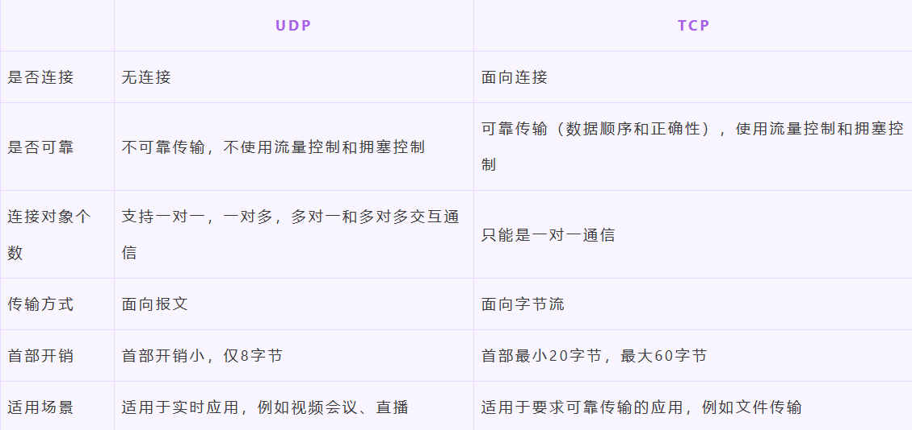

### 5.4、补充应用场景

- **UDP应用场景**：效率要求相对高，对准确性要求相对低的场景。例如：**QQ聊天、在线视频、网络语音电话**（即时通讯，速度要求高，但是出现偶尔断续不是太大问题，并且此处完全不可以使用重发机制）**、广播通信（广播、多播）**
- **TCP应用场景：** 效率要求相对低，但对准确性要求相对高的场景。因为传输中需要对数据确认、重发、排序等操作，相比之下效率没有UDP高。例如：**文件传输**（准确高要求高、但是速度可以相对慢）、**接受邮件、远程登录**。
-  **TCP粘包**：默认情况下, TCP 连接会启⽤延迟传送算法 (Nagle 算法), 在数据发送之前缓存他们. 如果短时间有多个数据发送, 会缓冲到⼀起作⼀次发送 （这样可能会出先粘包问题）
  - 解决方案：
  - **关闭 Nagle 算法**
  - **进⾏封包/拆包：** 封包/拆包是⽬前业内常⻅的解决⽅案了。即给每个数据包在发送之前, 于其前/后放⼀些有特征的数据, 然后收到数据的时 候根据特征数据分割出来各个数据包。
- **UDP不会粘包：**因为UDP本身是面向消息的传递，消息就是最小单位，不能再分割了，而且UDP会保护消息边界，UDP的头也能让接收方容易区处理

## 6、网络模型

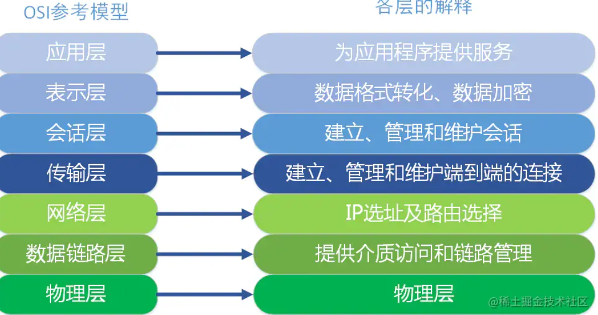

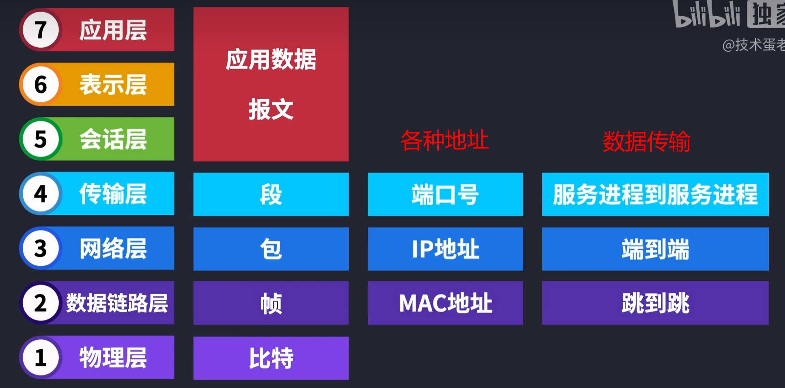

 ### 6.1、应用层

- 最接近用户的一层，为用户直接提供网络服务，我们常见应用层的网络服务协议有：`HTTP`，`HTTPS`，`FTP`(文件传输协议 百度网盘等)

### 6.2、表示层

表示层提供各种用于应用层数据的编码和转换和压缩等功能 ，可以使用`base64`对数据进行编解码

### 6.3、会话层

负责建立、管理和终止表示层实体之间的通信会话（管理登录状态，同步服务等）

### 6.4、传输层

- 当我拥有了ip和mac地址之后，信号已经可以到达对方主机了，但是对方主机如果运行了多个软件进程，那我应该如何准确传递数据到指定的软件服务上呢？？？
- **所以传输层有了端口号作为地址来定位！！**

建立主机端到端的连接，比如tcp udp 协议就是在这一层，传输层的作用是为上层协议提供端到端的可靠和透明的数据传输服务，包括处理差错控制和流量控制等问题

### 6.5、网络层

- 于是就有了ip逻辑地址解决mac地址的缺点
- **路由器根据数据包里的ip地址进行信号传递**

通过`ip寻址`建立两个节点之间的连接，正确无误地按照地址传送给目的端的运输层，网络层规定了数据包的传输路线，而传输层则规定了数据包的传输方式。（ip ARP 协议)

### 6.6、数据链路层

- 信号要去到哪台设备？？ 利用**MAC地址与交换机传递信号 ”跳到跳的传递“**
- 缺点：如果只有mac物理地址的话 离得远就很难定位！！

将比特组合成字节,再将字节组合成帧,使用链路层地址，而数据链路层就是传输路线。不过，在数据链路层上还增加了差错控制的功能（物理层传输信号的时候可能不准确）。（Ethernet 封装地址 数据传输）

### 6.7、物理层

通过物理介质（平衡电缆、光纤、无线信道）传输比特流（usb)。（涉及编码、调制等操作——将数字数据或者模拟数据（语音，音频）转换成数字信号或者模拟信号。 涉及端点与端点的的数据交换方式——电路交换，报文交换，分组交换）

### 6.8、数据流通过程总结

- 1、客户端发送数据也就是报文（应用层）

  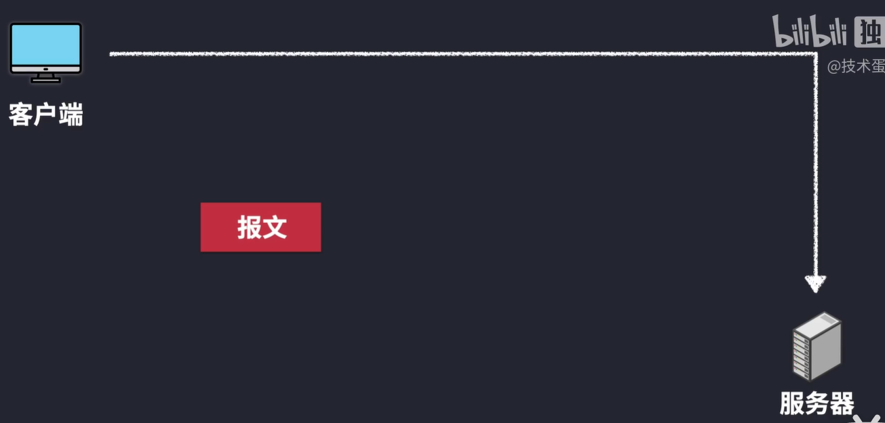

- 2、报文经过传输层封装成段（加上了端口号）

  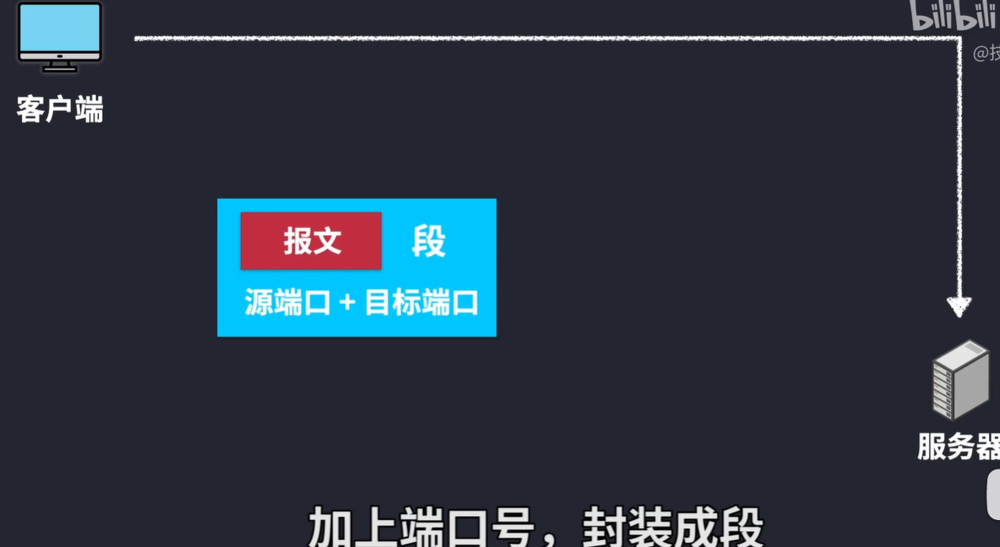

- 3、段来到了网络层封装成包（加上了ip地址）

  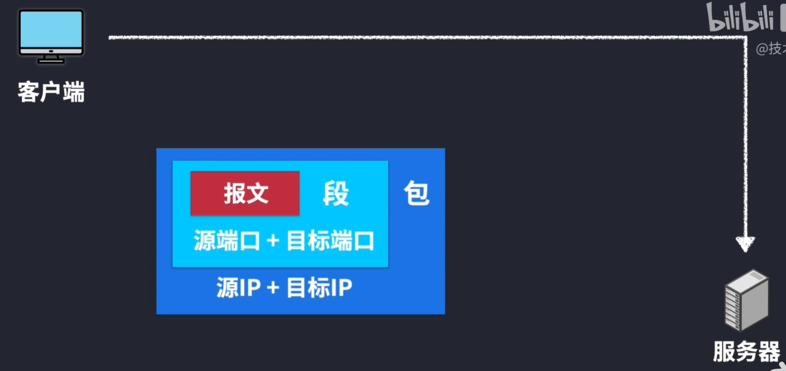

- 4、由于目标ip不是同一个网络所以需要网关（默认网关其实就是一个默认ip地址其本质可以在路由器，交换机上等等。。。）通过找这个ip地址寻求帮助

  - 当然如果目标ip和当前ip在一个子网就不需要网关
  - 利用**ARP**协议先拿到网关的mac地址

  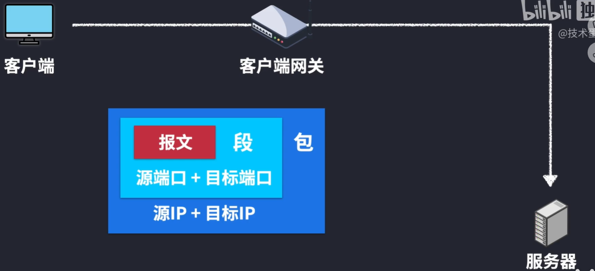

  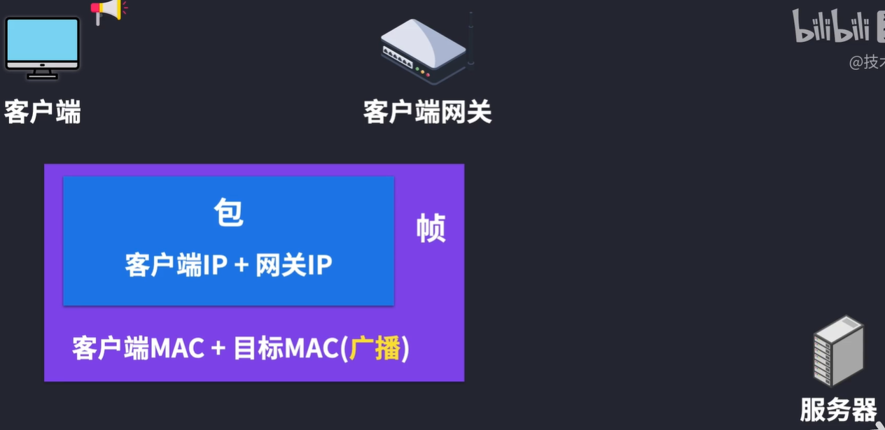

- 5、包有了mac地址之后就来到了数据链路层，封装成帧（以下解释怎么拿到网关mac地址的）

  - 先利用广播把这个帧给二层交换机，二层交换机又会给客户端网关，客户端网关解帧，把自己的mac地址再回给客户端

    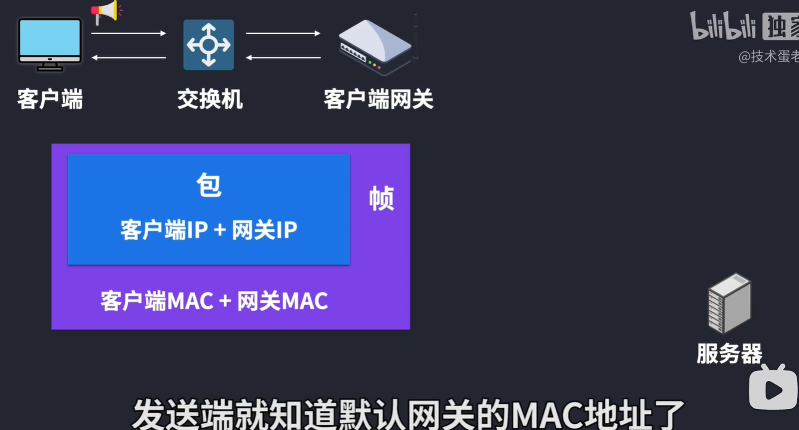

  - 回给客户端之后再给客户端网关（此时已经拿到了网关的mac地址直接把所有东西给网关即可）

    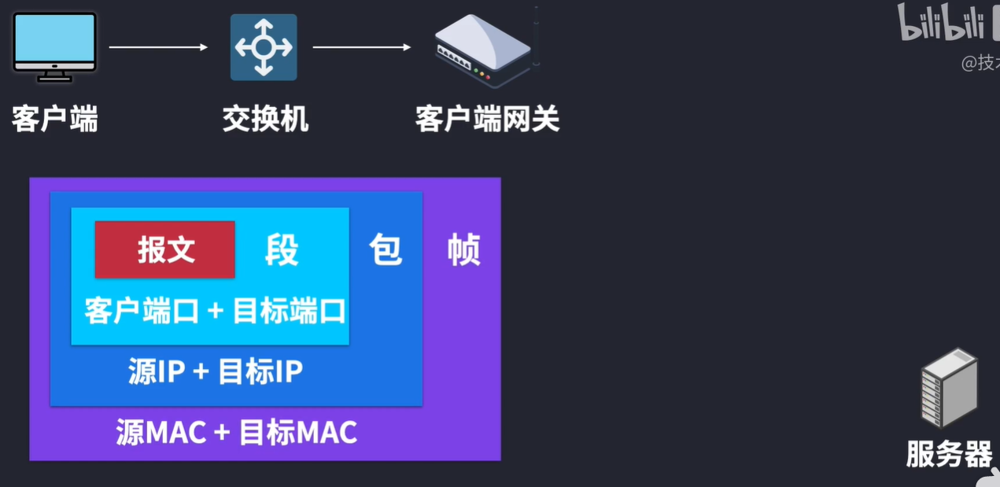

  - 客户端网关再进行路由转发（这个时候又回到了网络层解帧了）

    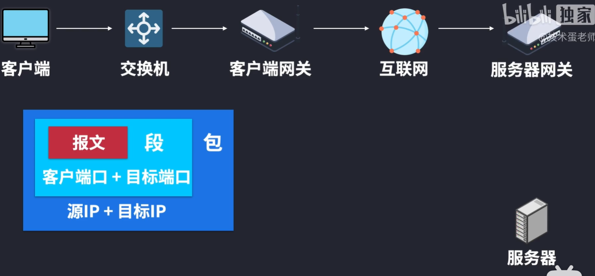

- 6、目标服务器网关拿到包之后封装成帧就送到目标服务器去了

  - 如果目标服务器网关不知道目标服务器的ip和mac 可以ARP协议再用一用

  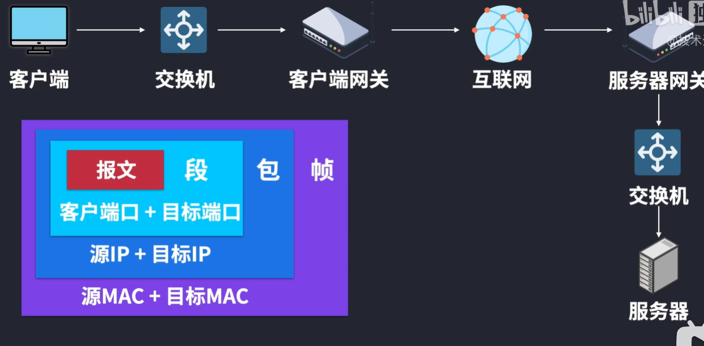

- 7、目标服务器拿到收到信息之后，逐层解封拿到段，根据段里的端口号为指定应用程序做出回应

  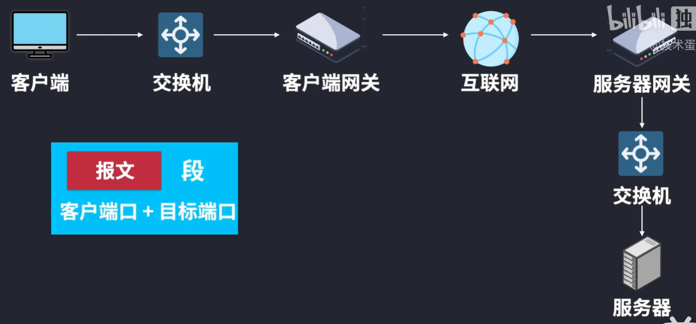

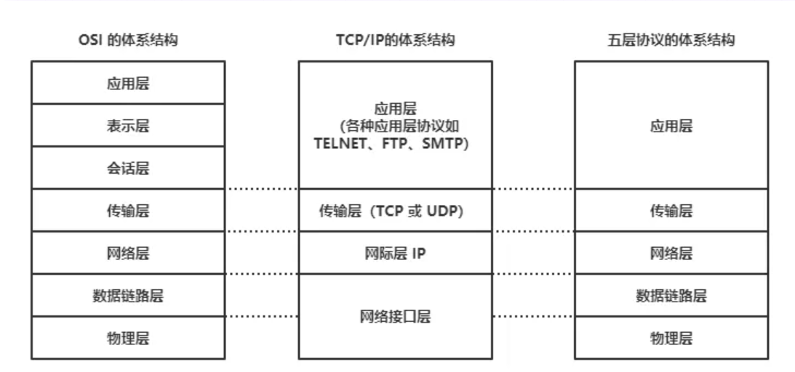

## 7、浏览器基本知识

### 7.1、浏览器的组成

- shell 是指浏览器的外壳：例如菜单，工具栏等。主要是提供给用户界面操作，参数设置等等。它是调用内核来实现各种功能的。

- 内核是浏览器的核心。内核是基于标记语言显示内容的程序或模块。

  - 浏览器内核的理解：

    - 渲染引擎的职责就是渲染，即在浏览器窗口中显示所请求的内容。默认情况下，渲染引擎可以显示 html、xml 文档及图片，它也可以借助插件显示其他类型数据，例如使用 PDF 阅读器插件，可以显示 PDF 格式。

    - JS 引擎：解析和执行 javascript 来实现网页的动态效果。

### 7.2、浏览器渲染原理

- 首先解析收到的文档，根据文档定义构建一棵 **DOM 树**，DOM 树是由 DOM 元素及属性节点组成的。（parse）

​       然后对 CSS 进行解析，**生成 CSSOM 规则树**。(computed style)

- 根据 DOM 树和 CSSOM 规则树构建**渲染树**。渲染树的节点被称为渲染对象，渲染对象是一个包含有颜色和大小等属性的矩形，渲染对象和 DOM 元素相对应，但这种对应关系不是一对一的，不可见的 DOM 元素不会被插入渲染树。还有一些 DOM元素对应几个可见对象，它们一般是一些具有复杂结构的元素，无法用一个矩形来描述。
- 当渲染对象被创建并添加到树中，它们并没有位置和大小，所以当浏览器生成渲染树以后，**就会根据渲染树来进行布局（也可以叫做回流）**。这一阶段浏览器要做的事情是要弄清楚各个节点在页面中的确切位置和大小。**通常这一行为也被称为“自动重排”。**
- 重新布局之后，还要**分层**，为了更加方便地实现这些效果（3d旋转 移动 缩放），渲染引擎还需要为特定的节点生成专用的图层，并生成一棵对应的**图层树（Layer Tree）**
- 布局阶段结束后是**绘制阶段**，遍历渲染树并调用渲染对象的 paint 方法将它们的内容显示在屏幕上。**重绘（Repaint）**
- **分块**  通常一个页面可能很大，但是用户只能看到其中的一部分，所以没必要全部绘制页面 所以分块了
- **栅格化（raster）**转换图片

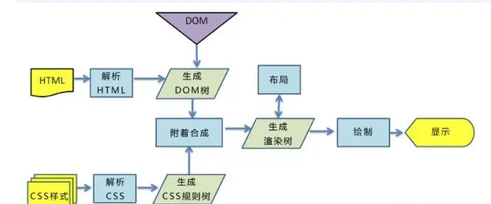

- 渲染优化：
  - 异步引入js
  - 减少CSS代码的层级，因为选择器是从左向右进行解析的
  - 减少重排重绘

### 7.3、浏览器的缓存原理

- 主要是先要搞清楚各个字段的作用
- 如果是http 1.1 回去先判断 etag 资源标识符
- 拿到资源标识符之后 利用 if -None - Match 发送请求 服务端根据这个标识符判断资源是不是最新的
- 是最新的返回304 不是最新的更新资源返回200
- 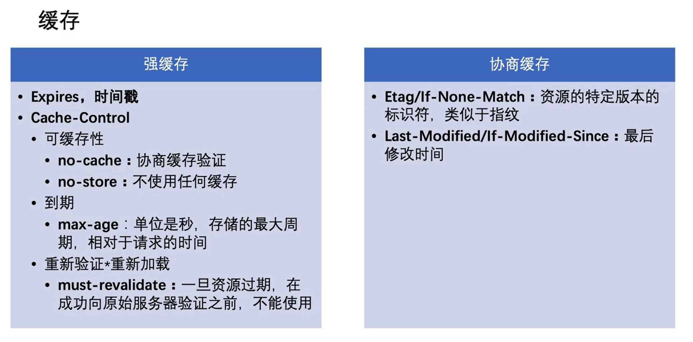
- 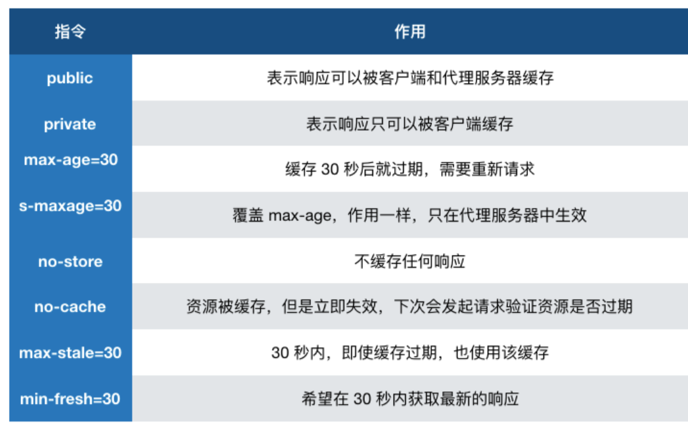

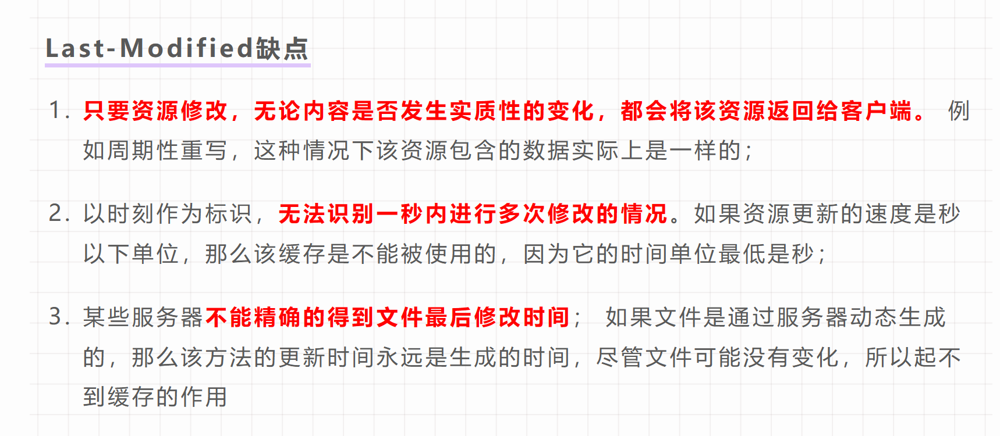

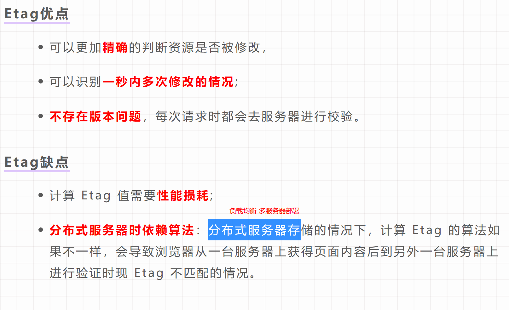

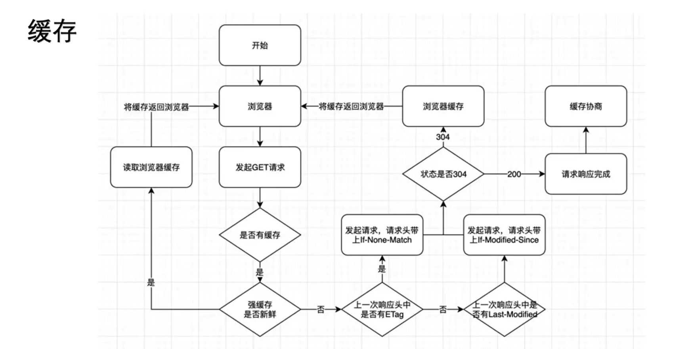

### 7.4、浏览器性能优化监控

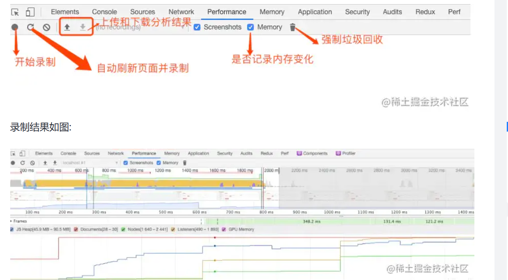

- 利用**performance API** 粗略算一下时间 （下面的api 大小写有问题 注意！！！）

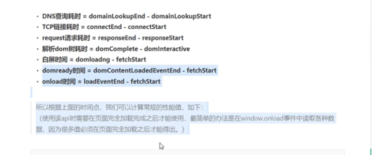

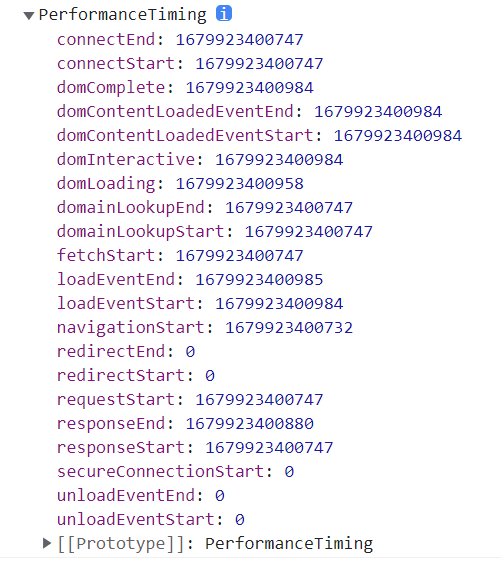

### 7.5、浏览器的垃圾回收机制

浏览器通常使用的垃圾回收方法有两种：标记清除，引用计数。 

- **标记清除**
  - 标记清除是浏览器常见的垃圾回收方式，当变量进入执行环境时，就标记这个变量“进入环境”，被标记为“进入环境”的变量是不能被回收的，因为他们正在被使用。当变量离开环境时，就会被标记为“离开环境”，被标记为“离开环境”的变量会被内存释放。
- **引用计数**
  - 这个用的相对较少，被引用就记一次数，相反，如果包含对这个值引用的变量又取得了另外一个值，则这个值的引用次数就减1。最后到0就回收。缺点：循环引用的变量永远回收不了，就算已经没价值了

**介绍v8引擎的垃圾回收机制**：

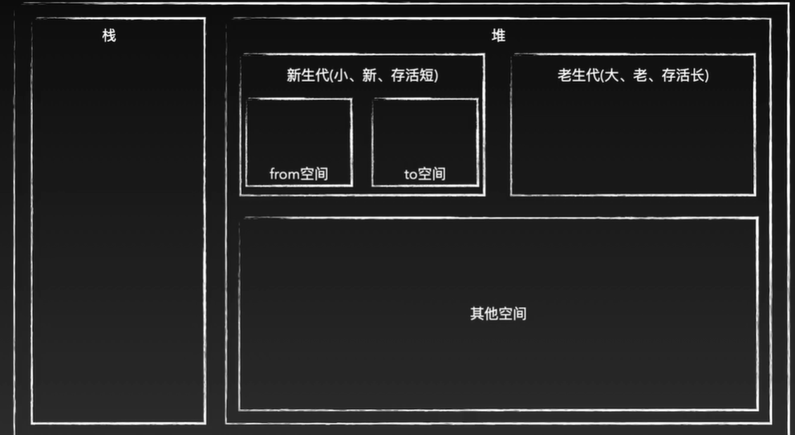

- 堆里分两块空间 一块新生代 一块老生代

-  **新生代**的对象一般存活时间较短，使用 Scavenge GC 算法

  - 新生代区域分from空间（使用空间） to空间（闲置空间） from空间要满的时候就对存活的对象进行标记然后转移到闲置空间。

  - 然后将from空间清空并和to空间名字兑换

    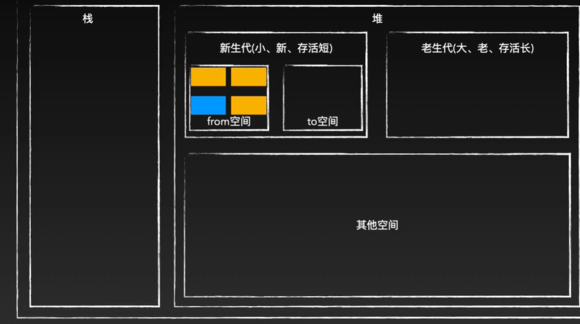

    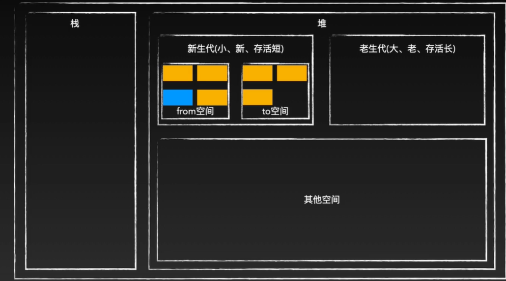

    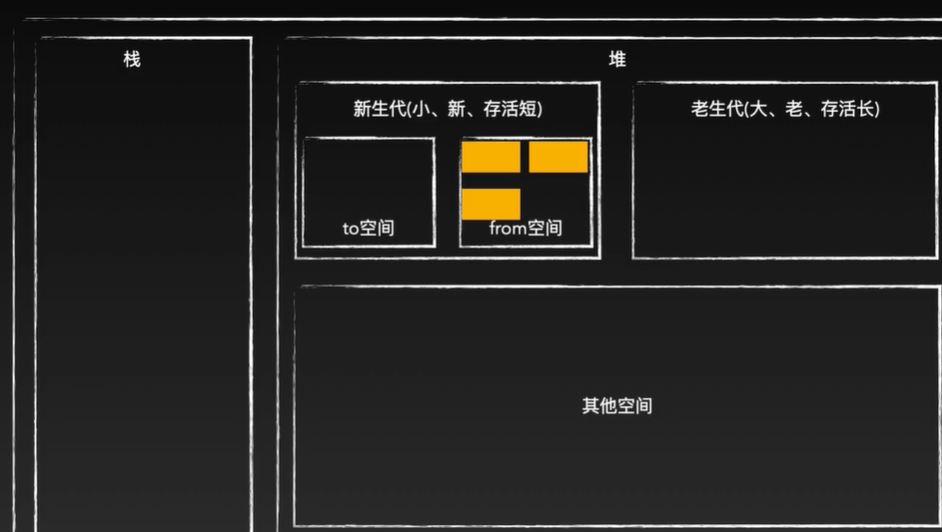

- **老生代**对象一般存活时间较长且数量也多 **标记清除算法**和**标记压缩算法**。

  - 首先将所以对象标记为0 存活对象标记为1 将为0的对象全部清空

    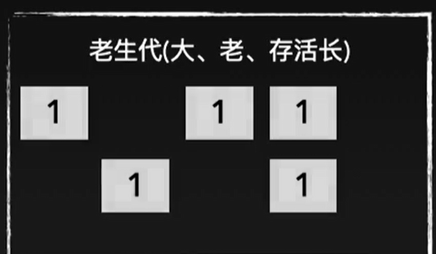

  - 然后将标记为1的对象标记为0

    

  - 然后标记压缩整理位置

    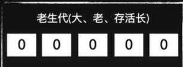

- v8还有一些其他的优化 比如 多线程回收 等等
