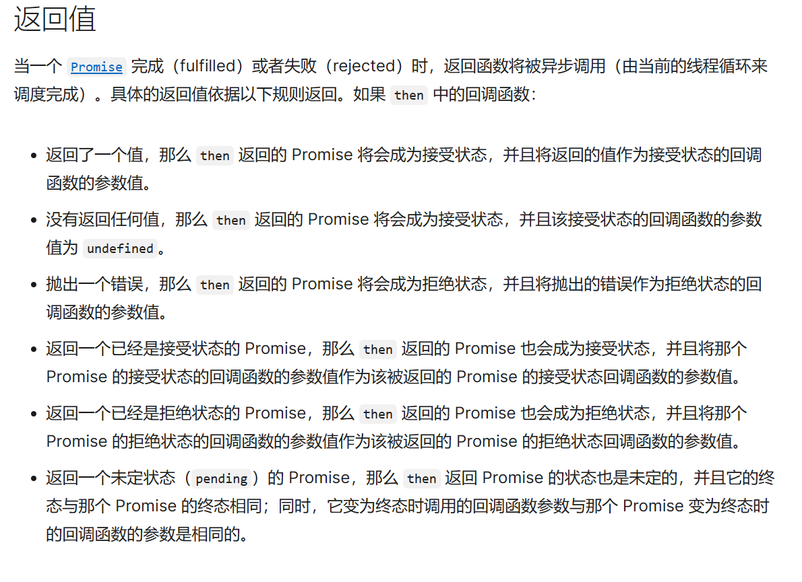

## 1、回调函数

- 解释：把一个函数当作参数传递给一个主函数 当调用主函数的时候，主函数的函数体会再去调用这个函数，那么被调用的函数就是“回调函数”，这个过程称之为“回调”

- 缺点：1、回调地狱 难以维护 可读性差，2、牵一发而动全身

## 2、回调函数的解决方案

### 2.1、Generator与生成器函数function*

- 生成器函数：
  - 可以分步执行的函数 返回值是一个Generator迭代器
  - 关键字 yield ，每调用一次Generator.next会执行一个yield 返回值就是yield的右值（yield*表示转移到另一个生成器函数）
  - Generator.next（parms）接参数，参数会作为上一个yield的返回值，如果不接就是undefined
  - 显示return return的右值就是Generator.next（）的返回值 并且遇到函数内部执行到return 会导致生成器立即变为完成状态

~~~~js
// 案例1
function *gen(){
    yield 10;
    x=yield 'foo';
    yield x;
}
var gen_obj = gen();
console.log(gen_obj.next());// 执行 yield 10，返回 10
console.log(gen_obj.next());// 执行 yield 'foo'，返回 'foo'
console.log(gen_obj.next(100));// 将 100 赋给上一条 yield 'foo' 的左值，即执行 x=100，返回 100
console.log(gen_obj.next());// 执行完毕，value 为 undefined，done 为 true

// 案例2
function *foo(x) {
  let y = 2 * (yield (x + 1))
  let z = yield (y / 3)
  return (x + y + z)
}
let it = foo(5)
console.log(it.next())   // => {value: 6, done: false}
console.log(it.next(12)) // => {value: 8, done: false}
console.log(it.next(13)) // => {value: 42, done: true}
~~~~

### 2.2、Promise

- 基本概念

  ~~~js
  const promise = new Promise((resolve, reject)=>{})
  ~~~

  - promise实例的两个属性 state状态  result结果

- promise的状态
  - pending（准备）
  - fulfilled  (已完成 成功)
  - rejected（已拒绝 失败）

- 改变promise状态

  ~~~js
  const promise = new Promise((resolve, reject)=>{
      // 调用函数使得promise进入fulfilled状态
      resolve()
      // 调用函数使得promise进入rejected状态
      reject()
      // 两个状态互斥 确定好一个状态之后就不会轻易改变了 比如上述状态就是fulfilled 
  })
  ~~~

- promise的结果

  ~~~js
  const promise = new Promise((resolve, reject)=>{
      // 向外传递参数 改变promise对象的结果
      resolve('成功的结果')
     
      reject('失败的结果')
  })
  console.log(promise)
  ~~~

- promise的方法

  ~~~js
  const promise = new Promise((resolve, reject)=>{
      // 向外传递参数 改变promise对象的结果
      resolve('成功的结果')
     
      reject('失败的结果')
  })
  // 1、 .then方法接受两个回调 第一个回调是fulfilled状态执行 第二个回调rejected状态执行
  // .then()方法得返回值看下图
  promise.then((data)=>{}, (err)=>{})
  
  // 我们用t变量去接受promise.then()的返回值 也可以链式调用
  const t = promise.then((data)=>{
      // 这个return 可以改变 t这个新实例的状态（pading -> fulfilled）从而时得t可以继续.then() 这就是为什么可以链式调用
      return '123'
      // 如果这个函数体有代码错误t得状态会变成(rejected)
      
  },(err)=>{})
  // **此时t.then()监听得其实就是上一个.then()得第一个参数的函数体！！！！
  t.then((data) => {
      console.log(data)  // 123
  },(err)=>{})......
  
  // 2、 .catch()方法与.then()得第二个参数用途是一样的
  //条件： promise状态为rejected
  // 		promise执行体代码出错误了
  
  // 3、.finally 方法用于指定不管 Promise 对象最后状态如何，都会执行的操作。该方法是 ES2018 引入标准的。
  // 使用场景：先用promise处理请求 然后用这个方法关掉服务器
  
  // 4、Promise.all方法可以完成并行任务， 它接收一个数组，数组的每一项都是一个promise对象。当数组中所有的promise的状态都达到resolved的时候，all方法的状态就会变成resolved，如果有一个状态变成了rejected，那么all方法的状态就会变成rejected。
  let promise1 = new Promise((resolve,reject)=>{
  	setTimeout(()=>{
         resolve(1);
  	},2000)
  });
  let promise2 = new Promise((resolve,reject)=>{
  	setTimeout(()=>{
         resolve(2);
  	},1000)
  });
  let promise3 = new Promise((resolve,reject)=>{
  	setTimeout(()=>{
         resolve(3);
  	},3000)
  });
  Promise.all([promise1,promise2,promise3]).then(res=>{
      console.log(res);
      //结果为：[1,2,3] 
  })
  // 5、Promise.race race方法和all一样，接受的参数是一个每项都是promise的数组，但是与all不同的是，当最先执行完的事件执行完之后，就直接返回该promise对象的值。如果第一个promise对象状态变成resolved，那自身的状态变成了resolved；反之第一个promise变成rejected，那自身状态就会变成rejected。（通俗点就是看谁快！！）
  
  let promise1 = new Promise((resolve,reject)=>{
  	setTimeout(()=>{
         reject(1);
  	},2000)
  });
  let promise2 = new Promise((resolve,reject)=>{
  	setTimeout(()=>{
         resolve(2);
  	},1000)
  });
  let promise3 = new Promise((resolve,reject)=>{
  	setTimeout(()=>{
         resolve(3);
  	},3000)
  });
  Promise.race([promise1,promise2,promise3]).then(res=>{
  	console.log(res);
  	//结果：2
  },rej=>{
      console.log(rej)};
  )
  //当要做一件事，超过多长时间就不做了，可以用这个方法来解决：
  Promise.race([promise1,timeOutPromise(5000)]).then(res=>{})
  
  
  // 6、Promise.resolve() 一个语法糖
  	Promisie.resolve(x)  等同于 new Promise((resolve) => resolve(x))
  // 7、Promise.reject()  一个语法糖
  	Promisie.reject(x)  等同于 new Promise((resolve,reject) => reject(x))
  ~~~

  // 还有一些其他静态方法（每一个promise看成一头猪）

  

  

  - .then()返回的promise实例有些复杂具体的返回值会根据.then()里的回调函数的返回值来决定

    

#### 2.2.1、手写promise

~~~js
// 测试文件 vscode Vue/promise/手写promise

// 基本结构 + 修正this指向 + 对异常错误处理
// 现在进行最关键的添加异步过程
// 原生的promise then方法是异步执行的 并且resolve方法也是异步执行的(可自己测试)  
// 1、给then方法添加异步 两个回调函数必须是异步执行
// 2、给resolve也添加异步过程 
// 但是又有一个问题 then是异步 resolve也是异步，then方法本身也是依靠resolve改变状态 所以必须让then方法等一等resolve方法
// 1、添加数组保存回调函数  this.resolveCallBacks = [], this.rejectCallBacks = []
// 2、保存完后放到resolve末尾执行 	
class Commitment {
    // 定义状态
    static PENDING = '待定'; static FULFILED = '成功';static REJECTED = '失败';
    constructor(fun) {
        this.status = Commitment.PENDING
        this.result = null
        this.resolveCallBacks = []
        this.rejectCallBacks = []
        try{
            // 修正this指向
            fun(this.resolve.bind(this), this.reject.bind(this))
        }
        catch(err) {
            this.reject(err)
        }
    }
    resolve(result) {
        setTimeout(()=>{
            if(this.status === Commitment.PENDING) {
            this.status = Commitment.FULFILED
            this.result = result
            this.resolveCallBacks.forEach((item)=> {
                item(result)
           })
        }
        })
    }
    reject(result) {
        setTimeout(()=>{
            if(this.status === Commitment.PENDING) {
            this.status = Commitment.REJECTED
            this.result = result
           this.rejectCallBacks.forEach((item)=> {
                item(result)
           })
        }
        })

    }
    then(onFULFILLED, onREJECTED) {
        onFULFILLED = typeof onFULFILLED === 'function' ? onFULFILLED : ()=>{}
        onREJECTED = typeof onREJECTED === 'function' ? onREJECTED : ()=>{}
        if(this.status === Commitment.PENDING) {
            this.resolveCallBacks.push(onFULFILLED)
            this.rejectCallBacks.push(onREJECTED)
        }
        else if(this.status === Commitment.FULFILED) {
            setTimeout(()=>{
                onFULFILLED(this.result)
            })
        }
         else if(this.status === Commitment.REJECTED) {
             setTimeout(()=>{
                 onREJECTED(this.result)
             })
        }
    }
}
~~~

#### 2.2.2、promise的缺点

1、无法取消Promise,一旦新建它就会立即执行，无法中途取消。

2、如果不设置回调函数，promise内部抛出的错误，不会反应到外部。

3、当处于pending状态时，无法得知目前进展到哪一个阶段（刚刚开始还是即将完成）。

### 2.3、async/await

- 异步的终极解决方案：（Generator + promise）的语法糖

- 语法规则

  ~~~js
  async function testAsy(){
     return 'hello world'; //async 函数返回的是一个 Promise 对象  如果在函数中 return 一个直接量，async 会把这个直接量通过 Promise.resolve() 封装成 Promise 对象
  }
  let result = testAsy(); 
  console.log(result) // promise实例
  ~~~

  

- await 到底在等什么，为什么必须在async函数里才能用？

  ~~~js
  1、如果它等到的不是一个 Promise 对象，那 await 表达式的运算结果就是它等到的东西。
  2、如果它等到的是一个 Promise 对象，await 就忙起来了，它会阻塞后面的代码，等着 Promise 对象 resolve，然后得到 resolve 的值，作为 await 表达式的运算结果。
  
  function testAsy(x){
     return new Promise(resolve=>{setTimeout(() => {
         resolve(x);
       }, 3000)
      }
     )
  }
  async function testAwt(){    
    let result =  await testAsy('hello world');
    console.log(result);    // 3秒钟之后出现hello world
    console.log('cuger')   // result 和cuger同时打印
  }
  testAwt();
  console.log('cug')  //立即输出cug
  
  // 这就是await为什么必须在异步函数里用，异步函数的调用本身不会阻塞，但是函数内部的await会阻塞进程
  ~~~

- async的优劣
  - 代码更加同步 替代了.then链式调用
  - 调试友好（方便打断点）
  - 如果多个异步代码没有依赖性却使用了 `await` 会导致性能上的降低 不如用 promise.all 的方式

#### 2.3.1、手写async

~~~~js
// 测试文件 vscode Vue/promise/手写async

function async(generator) {
    return	new Promise((resolve, reject)=>{
    let iterator = generator()
    function handleIterator(iteratorResult) {
        if(iteratorResult.done){ 
            resolve((iteratorResult.value)) 
            return
        }
        // 拿到yield的右值
        let iteratorVal = iteratorResult.value
        if(iteratorVal instanceof Promise) {
            iteratorVal.then((data) => {
                // 递归处理下一个yield 并将promise结果传递给yield的左值
                handleIterator(iterator.next(data))
            }).catch((err)=>{
                iterator.throw(err)
            })
        }
        else {
            handleIterator(iteratorResult.next(iteratorVal))
        }
    }
    try {
         handleIterator(iterator.next())
    }catch(err) {
        iterator.throw(err)
    }
    })
}
// 调用自己的async函数 参数是一个匿名的生成器函数
async(function*(){
    let ans1 = yield axios.get('/ans1')
    let ans2 = yield axios.get('/ans2')
    let ans3 = yield axios.get('/ans3')
    let ans4 = yield 'hello world'
    ......
})
~~~~

## 3、Event lOOP

- 首先地球人都知道js是单线程执行任务的 只有一个调用栈！

  ~~~js
  // js有两大操作 同步任务 异步任务 异步任务又分为 微任务队列 宏任务队列
  // 调用栈会有直接执行同步任务 而把异步任务进行上述分类
  ~~~

- 主流浏览器对**宏任务**的划分：
  - 新程序（script标签）或者子程序（控制台里的写代码）
  - 事件的回调函数
  - setTimeout() 和setInterval()

- **微任务**：
  - promise.then .catch .finally
  - Mutation.Observe()
  - Object.observe()

- 事件循环机制的工作流程

  ~~~js
  1、首先执行script标签 也就是宏任务 在执行的过程中 同步任务直接执行 异步任务按照队列进行划分
  2、script标签执行完了之后 清空调用栈 微任务队列有任务的话 先执行微任务
  3、微任务队列清空了之后 会看一下浏览器是不是会渲染 渲染之后 执行下一轮宏任务
  4、某一轮宏任务执行完之后其中如果又有微任务，那么调用栈清空之后就回去调用微任务队列
  5、重复3
  6、没有微任务之后 就可以一直清空宏任务队列了
  
  // 总结下来就是 先宏任务因为有script标签 
  //            每次调用栈清空会优先去执行微任务队列
  //            每次微任务队列清空 浏览器会检查是不是要渲染一下
  ~~~

  

