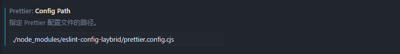

[[toc]]
作为一个有代码洁癖的人，写出高质量的整洁代码对我来说真的很重要。一段难看的代码会让人不想去看，即使是自己写的代码。对于一个大的团队项目来说，如果没有一个好的代码约束，代码的阅读性是灾难的，风格迥异的代码会让人失去耐心.....

于是，我花了两天时间来研究了一下如何利用工程手段（eslint + prettier）来约束项目的代码，统一代码风格。现在来分享一下我的成果。

## 代码质量 vs 代码风格

这里简单举几个例子即可

**代码质量**相关：

> 1. `no-unused-vars`：变量定义了但未使用。
>
> 2. `no-undef`：使用了未定义的变量或函数。
>
> 3. `@typescript-eslint/no-explicit-any`：在 TypeScript 中使用了 `any` 类型...

**代码风格**相关：

> 1. 缩进的间距
> 2. 代码换行问题
> 3. 单引号，逗号，分号....

## 我喜欢Prettier

[Prettier](https://prettier.io/)作为一款优秀的开源工具，可以非常快的帮你生成一套整洁的代码。如果你的项目缺少一个格式化工具那么我首推prettier。你只需要不到五分钟就可以集成prettier解决代码风格的问题。开箱即用，省时省力。可能我说不到五分钟你会怀疑，那么我来尝试一下。

#### 集成prettier

我们首先安装一下

~~~
npm install --save-dev --save-exact prettier
~~~

在项目根目录创建一个prettier的配置文件，prettier.config.js

#### 配置prettier

prettier的强大之处在于它本身其实只提供了20多个选项，可以去[官方文档](https://prettier.io/docs/options)了解一下，这里给出我的配置参考一下

~~~js
module.exports = {
  tabWidth: 2,  // 缩进宽度
  semi: false,  // 去除分号
  singleQuote: true, // 优先单引号
  trailingComma: 'none', // 对象或数组尾随逗号
  bracketSpacing: true, // 打印对象字面量中括号之间的空格
  objectWrap: 'preserve', // 控制对象属性的换行
  bracketSameLine: false, // 末尾标签的换行
  arrowParens: 'avoid', // 尽可能省略箭头函数括号
  vueIndentScriptAndStyle: false, // 不缩进vue里的script和style标签
  singleAttributePerLine: false // 不强制标签里每行只包含一个属性
}
~~~

#### 配合prettier插件

以vscode或者cursor为例，去下载一个prettier扩展。然后设置prettier为默认格式化工具即可。

这样利用快捷键 shift + alt + f 一键格式化就完成了。**当然prettier只能帮我们解决代码风格的问题**。

## Eslint + Prettier的最佳实践

> 首先我认为Eslint + Prettier是工程化项目保证代码质量和统一风格的最佳方案。

这里以[我的配置](https://github.com/laybrid/eslint-config-laybrid)为例子，给出团队项目的配置方案。（当然个人项目也可以直接用）

#### 初始化配置包

> 将配置发布成npm包更利于多个项目共享

执行npm init

这里给出关键的依赖（适配vue3 + ts）

~~~json
// packages.json  
"peerDependencies": {
    "@typescript-eslint/eslint-plugin": ">=5.0.0",
    "@typescript-eslint/parser": ">=5.0.0",
    "@vue/eslint-config-typescript": "^9.0.0", // eslint对vue3 + ts的预设
    "eslint": ">=8.0.0",  // eslint核心库
    "eslint-plugin-vue": ">=8.0.0"  //eslint对vue的检测
},
"dependencies": {
    "eslint-config-prettier": "^8.5.0",  // eslint 兼容 prettier
    "eslint-plugin-prettier": "^4.2.0", // 防止eslint prettier 冲突
    "prettier": ">=2.0.0" //自带prettier可以让用户免去手动安装prettier
}
~~~

#### 配置eslint和prettier

> ！这里eslint和prettier的配置文件一定要分开写，如果将prettier的配置文件内嵌到eslint的文件中，prettier插件会找不到位置

先在根目录创建prettier配置文件然后填写配置，同上

然后在根目录创建index.js,作为包的入口文件，配置eslint并且将prettier引入

~~~js
const prettierConfig = require('./prettier.config.cjs')

module.exports = {
  root: true,
  env: {
    node: true
  },
  extends: [
    'plugin:vue/vue3-essential',
    'eslint:recommended',
    '@vue/typescript/recommended',
    'plugin:prettier/recommended'
  ],
  parserOptions: {
    ecmaVersion: 2020
  },
  rules: {
    'array-callback-return': 'error',
    'no-await-in-loop': 'error',
    'no-duplicate-imports': 'error',
    'no-inner-declarations': 'error',
    'no-promise-executor-return': 'error',
    'no-self-compare': 'error',
    'no-template-curly-in-string': 'error',
    'no-unmodified-loop-condition': 'error',
    'no-unreachable-loop': 'error',
    // 'no-useless-assignment': 'warn' eslint version 9xxx,
    'new-cap': 'error',
    'prefer-const': 'error',
    'vue/multi-word-component-names': 'off',
    'vue/attribute-hyphenation': ['error', 'always'],
    'vue/component-definition-name-casing': ['error', 'PascalCase'],
    'vue/no-template-shadow': 'error',
      ........
    'prettier/prettier': ['error', prettierConfig]
  }
}

~~~

extends部分是引用了一些官方推荐和必须要的一些规则。这里我只展示了我的部分规则。其他规则可以去官方看

我的具体配置：https://github.com/laybrid/eslint-config-laybrid/blob/main/index.js

eslint的规则集合：https://eslint.org/docs/latest/rules/

eslint对vue的规则集合：https://eslint.vuejs.org/rules/

> 值得一提的是，我的库里引用了'plugin:vue/vue3-essential', 'eslint:recommended',这两个预设。所以在查看官方文档的时候有很多规则其实已经自动引入了，例如：eslint对vue的A类检测规则，已经全部引入了，当然如果不想要具体的某条规则可以单独写出来关掉，还有eslint核心的一些规则也已经自动引入了，只不过违反这些规则默认给的是warning,如果你想提高等级的话可以单独写某条规则然后将等级设置成error就可以了。

配置文件写好之后直接发布npm即可

#### 使用配置

项目首先npm下载配置包

然后在`package.json`或者`.eslintrc.js`中去拓展（以我的包为例）

~~~js
// .eslintrc.js
module.exports = {
  extends: ['eslint-config-laybrid']
}

// package.json
  "eslintConfig": {
    "extends": ["eslint-config-laybrid"],
    "rules": {}
  },
~~~

接下来需要配置**prettier插件**，这对我们的开发体验来说很重要。

>我个人喜欢先格式化代码再保存，还有一种方案是保存的时候自动格式化代码和检测代码，我不喜欢这种因为每次保存我的注意力会集中在终端看有没有报错，而格式化代码有时候也会有点问题，所以我习惯先格式化代码，格式化后的代码没问题之后再去ctrl s看终端。我喜欢两件事分开处理。

安装完prettier插件之后，只需要一个配置即可

设置prettier的config path， 目的是告诉插件你的prettier配置文件在哪

大功告成！！现在整个项目已经得到了eslint + prettier的约束，其他开发成员只需要下载prettier插件并配置即可。

## 其他观点与方案

在我阅读了Anthony Fu（eslint的开发者之一）[这篇博客](https://antfu.me/posts/why-not-prettier-zh)之后，对我有了新的启发。

> Anthony Fu主张用eslint来解决代码质量和代码风格两个问题。放弃掉不够灵活的prettier

#### prettier的缺陷

prettier作为一个**固执己见** 的代码格式化工具，虽然它开箱即用十分方便，但是也侧面印证了它的定制化没有那么灵活（prettier本身对外只有二十多个核心规则相较于eslint来说非常非常少），我将用代码换行来举例，来展示prettier的固执。

场景：一个较长的函数调用链

~~~js
// 原始代码
const result = someService
  .fetchData()
  .then(response => {
    return response.data;
  })
  .catch(error => {
    console.error(error);
  });
~~~

这段代码本身已经结构清晰，开发者通过手动换行让每个链式步骤独立一行。现在，我们看两种工具会如何处理它。

**方案 A：EsLint + Prettier 协同**

当 Prettier 检测到这段代码时，它会检查每行的字符数是否超过 `printWidth`（默认 80）。假如这个值被设置的偏大，Prettier 可能会**将其合并为一行**，因为它的规则倾向于宽度（printWidth）允许的情况下减少换行。

~~~js
const result = someService.fetchData().then(response => {
  return response.data;
}).catch(error => {
  console.error(error);
});
~~~

这种变换从某种角度来有两个缺点：

1. 破坏了开发者手动建立的视觉层次
2. 加入将来有人在.then的回调中添加代码代码，prettier会再次换行，从而在 **git diff** 中产生大量“无效变动”（换行符变更）

所以这个例子可以看出prettier有点固执，固执的只根据printwidth这个属性来决定代码是否换行。

**方案 B：EsLint 统一负责**

~~~js
const result = someService
  .fetchData()
  .then((response) => {
    return response.data;
  })
  .catch((error) => {
    console.error(error);
  });
~~~

代码的换行结构被完整保留，每个链式调用依然独立一行，保持了可读性。

这种“保守”的格式化不会因为后续修改内容而频繁触发换行变化，git diff 将只显示实际修改的内容。

>当然eslint可以做到像prettier那样不保留“开发者的意愿”去换行。这取决于你怎么配置。

通过这个例子我想强调的是，prettier是简单的开箱即用的但确实它的定制化不如eslint那么自由和灵活。

#### 两种方案的选择

那么我们就应该使用eslint全权接管我们的项目代码而放弃prettier吗？

这里我直接给出我的结论

>1、团队项目我更建议使用eslint + prettier，原因在于Prettier 的“固执”确保了即使团队成员代码习惯不同，也能格式化出绝对一致的代码。
>
>2、prettier的开箱即用非常节省时间，如果你不想在规则方面花费太多时间你应该选择prettier + eslint
>
>3、如果你是个人开发者并且有高度的代码洁癖你可以选择eslint全权接管你的代码。但确实eslint规则特别多，需要花费不少时间来精心打磨你的规则。

## 结语

这篇文章主要是分享我在代码规范方面的探索成果，本身这件事情也是一个非常主观的事情，如果这篇文章对你有启发的话，那正是我想要的。